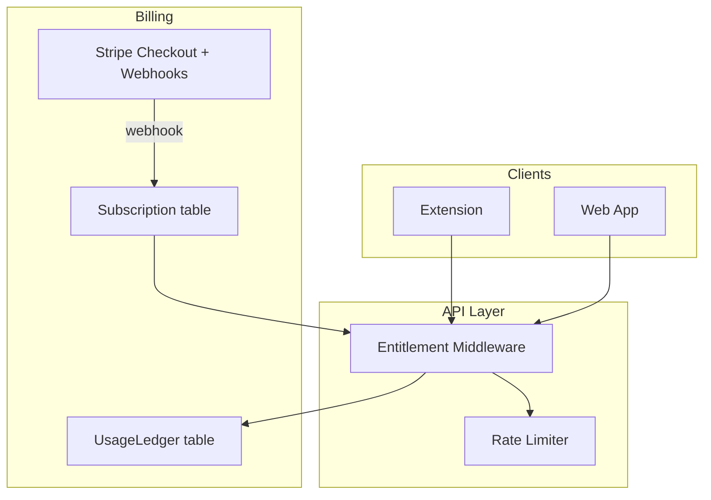

# Draft AI: Million-Dollar Product Roadmap

**Product:** Draft AI — AI-powered job-seeker outreach via Chrome extension (X/LinkedIn) + Next.js web app (profile, Gmail send, analytics).

**Actual stack (not React Native):** Next.js 16, React 19, Plasmo MV3 extension, PostgreSQL/Prisma, OpenAI gpt-4o-mini, Google OAuth + Gmail API, UploadThing.

**Current maturity:** Strong end-to-end MVP. Core loop works. No billing, incomplete production hardening, high onboarding friction, no habit loops.

**$1M ARR math (target):**
- Blended ARPU ~$28/mo → **~3,000 paying subscribers**
- At 5% free→paid → **~60,000 activated free users**
- Or hybrid: 2,000 consumers @ $25/mo + 50 bootcamp partners @ $400/mo = **$70K MRR**

---

## Pillar 1: Behavioral Psychology & Human Tendencies

### Core Psychological Utility

Draft AI solves **rejection anxiety disguised as procrastination**. Job seekers know outreach works but avoid it because:
- Crafting personalized messages is cognitively expensive
- Generic templates feel shameful ("I'm spamming")
- Silence after sending triggers learned helplessness
- The job search itself is an identity threat

The product's real job: **lower the activation energy for socially risky behavior** while preserving the user's sense of authenticity.

### Hook Model Mapping

```mermaid
flowchart LR
  subgraph trigger [Trigger]
    T1[External: hiring post in feed]
    T2[Internal: anxiety about job search]
    T3[Retained: reply notification]
  end
  subgraph action [Action]
    A1[Click Draft button]
    A2[Edit and send/copy]
  end
  subgraph reward [Variable Reward]
    R1[Personalized draft quality]
    R2[Match score insight]
    R3[Reply received]
    R4[Tone that outperforms]
  end
  subgraph investment [Investment]
    I1[Resume and profile data]
    I2[Outreach history]
    I3[Winning templates learned]
    I4[Streak and reply stats]
  end
  trigger --> action --> reward --> investment
  investment --> trigger
```

| Loop Stage | Today | Target State |
|------------|-------|--------------|
| **Trigger** | User must browse X/LinkedIn organically | Push: "3 new hiring posts match your profile" digest; badge on extension icon when feed has draftable posts |
| **Action** | 6-step setup before first draft | Reduce to <60s: `/try` demo → sign in → one-click extension install → draft |
| **Variable Reward** | Draft text (predictable) | Add variability: match score reveal, "this tone gets 2× replies for engineers", surprise reply celebration |
| **Investment** | Resume upload (high, front-loaded) | Shift investment post-reward: minimal profile → first draft → then deepen profile for better drafts |

**Habit target:** Daily 5-minute "outreach session" — browse feed, draft 1–3 messages, check inbox. Weekly ritual beats one-time setup.

### Emotional Triggers (First 60 Seconds)

| Emotion | Acute Pain | 60-Second Relief |
|---------|------------|------------------|
| **Fear of sounding generic** | "My message is invisible" | `/try` page: paste any post → instant before/after draft (already built at [`web/src/app/try/page.tsx`](web/src/app/try/page.tsx)) |
| **Imposter syndrome** | "I'm not qualified" | Match insight with highlights: "Your CRDT experience maps to their post" (partially built in [`draft/sidepanel.tsx`](draft/sidepanel.tsx)) |
| **Permission anxiety** | "Why does this need Gmail?" | Inline scope explainer before OAuth, not buried in privacy policy |
| **Hope** | "Maybe this time someone replies" | Show anonymized benchmark: "Users with warm tone see 18% reply rate" |

**Critical gap:** Onboarding is 10+ steps ([`web/src/app/onboarding/page.tsx`](web/src/app/onboarding/page.tsx)) before the user feels magic. The dopamine hit must move **before** resume upload, not after.

### Friction Points & Countermeasures

| Drop-off Point | Human Tendency | Ruthless Fix |
|----------------|----------------|--------------|
| Google sign-in | Trust friction | Progressive auth: try draft first, sign in to save |
| Resume upload | Laziness | Accept LinkedIn URL paste OR 3-field quick start (role, years, top skill) |
| Install extension | Context switch | Deep link to Chrome Web Store + auto-detect install via heartbeat |
| Connect extension | "API key" confusion | Rename to "Link extension"; one-tap connect only |
| Find a hiring post | Decision fatigue | Curated "Hiring posts today" feed in dashboard (scrape/suggest) |
| Edit draft | Perfectionism paralysis | "Good enough" send nudge + 3 tone variants (variant API exists) |
| No reply after 3 days | Learned helplessness | Follow-up draft suggestion: "Haven't heard back? Try this shorter bump" |
| Global `currentDraft` bug | Broken trust | Per-post draft storage in [`draft/lib/draft.ts`](draft/lib/draft.ts) — **P0** |

### Copy Reframe (Psychology-Driven)

- Replace "outreach" → **"start conversations"**
- Replace "send" → **"share thoughtfully"**
- Replace "cold email" → **"reply to their post"**
- Celebrate: **"3 conversations started this week"** not "3 emails sent"

---

## Pillar 2: UI/UX & Gamification Enhancements

### UX Bottlenecks (Codebase-Specific)

| Location | Problem | Impact |
|----------|---------|--------|
| [`web/src/app/onboarding/page.tsx`](web/src/app/onboarding/page.tsx) | 10+ step wizard, client-only auth guard | 60%+ drop-off before activation |
| [`draft/lib/draft.ts`](draft/lib/draft.ts) | Single `currentDraft` key | Wrong draft shown — destroys trust |
| [`draft/popup.tsx`](draft/popup.tsx) | Legacy `?section=extension` URL | Confusing deep links |
| [`web/src/app/dashboard/drafts/page.tsx`](web/src/app/dashboard/drafts/page.tsx) | Read-only drafts panel | User must leave dashboard to act |
| [`web/src/components/profile/preferences-section.tsx`](web/src/components/profile/preferences-section.tsx) | Language read-only; tone partially wired | Marketing promise gap |
| Extension vs web brand | Different SVGs in [`web/src/components/draft-ai-brand.tsx`](web/src/components/draft-ai-brand.tsx) vs `draft/components/` | Two products feeling |
| [`web/src/app/globals.css`](web/src/app/globals.css) | Dark mode tokens, no toggle | Half-built polish |
| Panel layout | All panels use identical 300px master-detail | Functional but monotonous |

### Immersive & Premium Upgrades

**Extension (highest-frequency surface):**
- Draft button: subtle pulse on first visit; spring animation on popover open (Framer already in `draft/`)
- Side panel: typewriter reveal for first line of draft (variable reward timing)
- Send/copy: confetti micro-celebration + haptic-style visual feedback (scale bounce)
- Match insight card: progress ring for score, chip highlights animating in

**Web dashboard:**
- Overview: animated reply-rate ring (not just stat card) on [`web/src/app/dashboard/page.tsx`](web/src/app/dashboard/page.tsx)
- Empty states with single CTA, not blank panels
- Skeleton loaders already exist per route — unify motion language with extension
- Color-tinted shadows per [`web/CLAUDE.md`](web/CLAUDE.md) guardrails (currently flat `shadow-sm`)

**Onboarding:**
- Collapse 10 steps → 3 acts: (1) Magic demo, (2) Profile minimum, (3) Go live
- Progress bar with milestone labels, not percentage only
- Extraction reveal: staggered animation of AI-filled fields (dopamine from "it knows me")

### Gamification Engine (Loss Aversion + Progress)

**Do NOT build:** Leaderboards, public shame, spammy notifications.

**Do build:**

| Mechanic | Implementation | Psychology |
|----------|----------------|------------|
| **Outreach streak** | "4-day conversation streak" — breaks if no draft/send for 48h | Loss aversion |
| **Weekly goal** | User sets "5 conversations/week"; progress ring on extension badge | Commitment device |
| **Reply trophy case** | Dashboard section: replies with post context thumbnails | Variable reward archive |
| **Tone leaderboard (personal)** | "Warm tone: 22% reply rate vs your 14% average" from [`web/src/lib/reply-metrics.ts`](web/src/lib/reply-metrics.ts) | Self-competition |
| **Milestones** | Badges: First Draft, First Reply, First Week, 10 Conversations | Achievement unlock |
| **Pipeline visualization** | Kanban: Drafted → Sent → Awaiting → Replied | Reduces anxiety via clarity |

**Data already exists** for tone insights and winning templates ([`web/src/app/actions.ts`](web/src/app/actions.ts) `syncWinningTemplatesFromReplies`). Surface it aggressively in UI.

---

## Pillar 3: Deep Technical Audit & Scalability

> **Note:** Stack is Next.js + Plasmo, not React Native/Expo. Mobile is not in scope today; Chrome extension is the mobile-equivalent high-frequency client.

### Performance & Reliability Bottlenecks

| Risk | Location | Severity |
|------|----------|----------|
| **Single global draft state** | [`draft/lib/draft.ts`](draft/lib/draft.ts), [`draft/contents/feed.ts`](draft/contents/feed.ts) | P0 — data corruption UX |
| **DOM scraping fragility** | [`draft/contents/feed.ts`](draft/contents/feed.ts), `profile.ts` | LinkedIn/X UI changes break injection |
| **No rate limiting** | [`web/src/app/api/match-job/route.ts`](web/src/app/api/match-job/route.ts), `send-email` | Cost/abuse at scale |
| **OpenAI sync in request path** | `match-job` route | 2–8s latency; no queue/retry |
| **Gmail sync cron** | [`web/vercel.json`](web/vercel.json) every 5 min | Won't scale past ~500 users without job queue |
| **No offline extension behavior** | Extension calls fail silently | Poor UX on flaky networks |
| **Plaintext API keys** | Prisma `ApiKey` model, `chrome.storage.local` | Security breach = full account compromise |

### Architectural Debt

| Issue | Files | Fix |
|-------|-------|-----|
| Monolithic server actions | [`web/src/app/actions.ts`](web/src/app/actions.ts) (~600+ lines) | Split into domain modules: `actions/profile.ts`, `actions/dashboard.ts` |
| No job queue | Mail sync, winning template sync | Add Inngest or BullMQ for async work |
| Heuristic token metering | `cacheHits * 1200` | Real usage tracking table for billing |
| Connect flow security | [`web/src/app/api/extension/connect/route.ts`](web/src/app/api/extension/connect/route.ts) | One-time server-side connect tokens (TTL 10 min) |
| Naming drift | `RECRUIT_PITCH_AUTH`, `rp_` prefix, repo `recruit-ai` | Unify to `draft-ai` / `da_` |
| Dead schema | `HiringProfile` in [`web/prisma/schema.prisma`](web/prisma/schema.prisma) | Build UI or remove |
| No `.env.example` | Root + `web/` | Deployment runbook |
| E2E only, no unit tests | [`web/e2e/*.spec.ts`](web/e2e/) (7 specs) | Unit test `reply-metrics`, `draft-prompt`, auth |

### IAP & Entitlement (Stripe — Not Yet Built)

**Current state:** Zero billing. No Stripe, no usage limits, no entitlements.

**Bulletproof entitlement architecture to build:**

**Edge cases to handle:**
- Webhook arrives before redirect → poll subscription status post-checkout
- Network drop mid-purchase → idempotent webhook processing with Stripe event IDs
- User downgrades mid-month → soft limit (finish current drafts, block new)
- Extension bypass → **all limits enforced server-side** on `/api/match-job` and `/api/send-email`, never client-side
- Refund/chargeback → revoke entitlements via webhook
- Free trial expiry → grace period + in-extension upgrade CTA

**Schema additions:** `Subscription`, `UsageLedger` (drafts_used, emails_sent, period_start), `PlanTier` enum.

### Skills Required (Team/Gaps)

| Skill | Why |
|-------|-----|
| Growth PM / behavioral design | Habit loops, paywall timing |
| Chrome extension engineering | MV3, content script resilience |
| Next.js App Router + Server Actions | Core web app |
| PostgreSQL/Prisma at scale | Usage metering, analytics |
| Stripe billing + webhooks | Monetization |
| LLM prompt engineering | Reply-rate optimization moat |
| DevOps (Vercel, Sentry, CI) | Production reliability |
| Gmail API / OAuth | Send + sync |
| Security (key hashing, rate limits) | Trust at scale |

---

## Pillar 4: Missing Feature Gap Analysis

### 4 High-Leverage Features (10× Better)

**1. Reply Intelligence Loop (Data Moat)**
- Auto-detect replies via Gmail sync (partially built in [`web/src/lib/email-sync/`](web/src/lib/email-sync/))
- Correlate: tone + post type + industry → reply rate
- Surface: "Use warm tone for startup founders — 2.3× your average"
- **Why 10×:** Competitors generate text; you optimize for outcomes

**2. Follow-Up Autopilot (Human-in-the-Loop)**
- 3 days no reply → suggest bump draft referencing original
- 7 days → suggest graceful close
- User approves every message
- **Why 10×:** Job seekers ghost themselves by not following up

**3. Opportunity Feed (Reduce Discovery Friction)**
- Dashboard: "12 hiring posts from your network today"
- Requires: keyword alerts, saved searches, or X/LinkedIn API alternatives
- MVP: browser bookmarklet or manual URL paste → draft
- **Why 10×:** Removes "finding posts" friction entirely

**4. Conversation CRM (Sticky Workflow)**
- Unified pipeline: Draft → Sent → Replied → Interview
- Link outreach to company, role, application status
- **Why 10×:** Becomes system of record for job search, not just a drafting tool

### AI Integration (Proprietary, Not Gimmicky)

| AI Feature | Implementation | Moat |
|------------|----------------|------|
| **Industry-tuned prompts** | [`web/src/lib/industry-classifier.ts`](web/src/lib/industry-classifier.ts) + reply data | Gets better with usage |
| **"Sounds like me" fine-tuning** | Store user edit diffs; few-shot examples in prompt | Personalization depth |
| **Post fit scoring** | `matchInsight` already computed | Help user prioritize where to spend social capital |
| **Reply sentiment analysis** | Classify reply tone (interested, polite-no, referral) | Smarter pipeline stages |
| **Weekly coach digest** | Email: "You sent 4, got 1 reply. Try shorter DMs." | Retention trigger |

**Avoid:** Chatbot career coach (commodity), auto-send (ToS/trust killer), resume rewriting (different product).

### Premium Ecosystem Features (Phase 3+)

- Bootcamp/coach dashboard (B2B2C, 10× ARPU)
- Template marketplace from anonymized winners
- Firefox + Edge extension (TAM expansion)
- Hacker News / Wellfound / Discord post detection
- Recruiter reverse mode (`HiringProfile` schema exists, no UI)

---

## Pillar 5: Million-Dollar Execution Roadmap

### Phase 1: Foundation & Friction Removal (Weeks 1–4)

**Goal:** Activation in <15 min. Nothing lies. Safe for real users.

**Week 1 — Trust & P0 Bugs**
- Per-post draft storage ([`draft/lib/draft.ts`](draft/lib/draft.ts) → `draftsByPostId` map)
- Fix extension deep links ([`draft/popup.tsx`](draft/popup.tsx) → `/dashboard/extension`)
- API key regenerate → extension disconnect notification
- Honest integration status on [`web/src/app/dashboard/extension/extension-page-client.tsx`](web/src/app/dashboard/extension/extension-page-client.tsx)
- Server-side connect token validation
- Sentry on web + extension error boundaries

**Week 2 — Onboarding Compression**
- Reorder: `/try` magic first → sign in to save → minimal profile (3 fields) → extension
- Defer work experience/projects to post-activation "improve your drafts"
- Progressive Gmail permission (only on first email send)
- Server auth guard on onboarding layout
- Scope explainer component in sign-in flow

**Week 3 — Production Hardening**
- Rate limiting on all Bearer routes (Upstash Redis or in-memory + DB)
- Hash API keys at rest; show prefix only
- `.env.example` + deployment README
- Account deletion + data export endpoints (privacy policy promise)
- CI: lint + build + e2e on PR

**Week 4 — Brand & Chrome Store**
- Unify [`draft-ai-brand.tsx`](web/src/components/draft-ai-brand.tsx) across web + extension
- Chrome Web Store listing polish (screenshots, demo video)
- Fix font cascade (Inter + Merriweather per design rules)
- Pricing page skeleton (even if billing not live — reduces setup anxiety)

**Phase 1 Success Metrics:**
- Time to first draft < 5 min (median)
- Onboarding completion > 40%
- Zero P0 bugs in extension draft flow

---

### Phase 2: Retention & Gamification (Weeks 5–8)

**Goal:** Week-2 retention > 30%. Daily habit formation.

**Week 5 — Habit Loops**
- Outreach streak system (DB: `UserStreak` table)
- Weekly goal setting in extension popup
- Reply celebration modal in dashboard + extension
- Push trigger: "You have 2 drafts waiting" (email digest)

**Week 6 — Gamification UI**
- Reply trophy case on dashboard overview
- Personal tone performance chart (leverage [`reply-metrics.ts`](web/src/lib/reply-metrics.ts))
- Pipeline kanban: Drafted → Sent → Awaiting → Replied
- Milestone badges (First Reply, 7-Day Streak, etc.)

**Week 7 — Reply Intelligence**
- Expand winning template sync ([`syncWinningTemplatesFromReplies`](web/src/app/actions.ts))
- "Messages that got replies" gallery with copy/adapt
- Tone recommendation based on user's historical data
- Follow-up draft suggestions (3-day, 7-day)

**Week 8 — Premium Feature Foundations**
- Conversation CRM (link outreach → company → status)
- Web-side draft preview + send (reduce extension-only dependency)
- Extension offline queue (retry failed sends)
- A/B tone variant UI polish in sidepanel

**Phase 2 Success Metrics:**
- Week-2 retention > 30%
- Draft → send rate > 50%
- Avg 3+ outreach actions/user/week

---

### Phase 3: Monetization & Scale (Weeks 9+)

**Goal:** $10K MRR in 6 months. Infrastructure for 10K users.

**Weeks 9–10 — Stripe & Entitlements**
- Stripe Checkout + Customer Portal + webhooks
- Plans: Free (10 drafts/mo, 3 emails), Pro ($25/mo), Power ($49/mo)
- Server-side usage enforcement on `match-job` + `send-email`
- Upgrade prompts at limit (extension + web)
- 14-day Pro trial after first successful send

**Weeks 11–12 — Growth Loops**
- Referral: "Give a friend 10 free drafts, get 10 when they send first"
- SEO landing pages: "LinkedIn outreach for software engineers"
- Bootcamp partnership pilot (white-label or affiliate)
- Case study pages with real reply-rate improvements

**Weeks 13+ — Scale Infrastructure**
- Job queue for Gmail sync (Inngest/BullMQ)
- OpenAI request queue with retry + fallback
- Database indexes on `SentOutreach`, `PostDraft` hot queries
- Admin dashboard: MRR, churn, usage, error rates
- Firefox extension
- Consider recruiter `HiringProfile` mode if B2B traction

**Phase 3 Success Metrics:**
- Free → paid conversion > 5%
- $10K MRR within 6 months of billing launch
- Reply rate tracked for 80%+ of sent outreach
- NPS > 40

---

## Priority Matrix (Ruthless Ordering)

| Priority | Item | Pillar | Why First |
|----------|------|--------|-----------|
| P0 | Per-post draft storage | Tech + Psych | Broken core promise |
| P0 | Onboarding compression | Psych | Activation is everything |
| P0 | Rate limiting + Sentry | Tech | Prevents death by OpenAI bill |
| P0 | Stripe + entitlements | Monetization | No revenue = no million |
| P1 | Streak + weekly goals | Gamification | Retention before acquisition |
| P1 | Reply intelligence UI | Features + Moat | Differentiation |
| P1 | Brand unification | UX | Chrome Store + trust |
| P2 | Follow-up drafts | Features | 10× value multiplier |
| P2 | Conversation CRM | Features | Stickiness |
| P3 | B2B bootcamp mode | Scale | ARPU expansion |
| P3 | Dark mode | UX | Polish after PMF |

---

## What "Million-Dollar" Actually Means

**$1M ARR is not a feature problem — it's a distribution + retention + monetization problem.**

Draft AI has a **working wedge** (in-feed, resume-aware drafting) that Huntr/Teal/Simplify don't own. The path:

1. **Compress activation** (psychology) → more users reach the hook
2. **Build reply-rate moat** (AI + data) → users can't leave without losing intelligence
3. **Habit loops** (gamification) → weekly job search ritual includes Draft AI
4. **Freemium with clear limits** (Stripe) → convert engaged users
5. **Chrome Store + SEO + bootcamps** (GTM) → distribution without burning cash

The codebase is ~70% of the way to a fundable MVP. The missing 30% — billing, habits, onboarding compression, and production security — is what separates a demo from a business.
