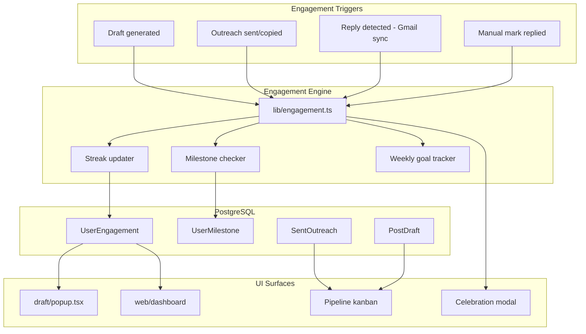

# Phase 2: Retention & Gamification (Weeks 5–8)

**Parent plan:** [million-dollar_growth_roadmap_044e2fa0.plan.md](./million-dollar_growth_roadmap_044e2fa0.plan.md)

**Goal:** Week-2 retention > 30%. Users form a weekly "conversation session" ritual.

**Phase 1 prerequisite:** Activation path works (<15 min to first draft), per-post drafts fixed, Sentry + rate limits live, onboarding compressed. Most Phase 1 items are in flight on the current branch — do not start Phase 2 until Phase 1 success metrics pass.

---

## Current State (What Phase 2 Builds On)

### Already exists — surface, don't rebuild

| Capability | Location | Gap |
|------------|----------|-----|
| Reply rate by tone/channel/platform | [`web/src/lib/reply-metrics.ts`](web/src/lib/reply-metrics.ts) | Tone insights only shown as text list on dashboard; no chart, no extension surfacing |
| User send/draft counters | [`web/src/lib/user-stats.ts`](web/src/lib/user-stats.ts) | No streak, no weekly goal, no milestone tracking |
| Winning template sync | [`web/src/app/actions.ts`](web/src/app/actions.ts) `syncWinningTemplatesFromReplies` | Manual-only; templates created with `isPublished: false`; dashboard shows static blockquotes, no copy/adapt |
| Lifecycle states (Sent/Aged/Responded) | [`web/src/lib/outreach-state.ts`](web/src/lib/outreach-state.ts) | Email panel has filters; no unified kanban across drafts + emails + DMs |
| Extension analytics API | [`web/src/app/api/extension/analytics/route.ts`](web/src/app/api/extension/analytics/route.ts) | Returns stats only — no streak/goal/milestones |
| Tone variants | [`web/src/app/api/match-job/variant/route.ts`](web/src/app/api/match-job/variant/route.ts), [`draft/sidepanel.tsx`](draft/sidepanel.tsx) | Variant switching works; UI is functional, not polished |
| Per-post draft storage | [`draft/lib/draft.ts`](draft/lib/draft.ts) `draftsByPostId` | Fixed in Phase 1 — prerequisite for reliable celebrations |
| Email reply detection | [`web/src/lib/email-sync/inbound-processor.ts`](web/src/lib/email-sync/inbound-processor.ts) | Triggers `incrementReplyStats` — hook celebrations here |
| Dashboard overview | [`web/src/app/dashboard/page.tsx`](web/src/app/dashboard/page.tsx) | Stat cards + basic tone insights; no trophy case, no streak, flat progress bar |

### Does not exist yet

- `UserEngagement` / `UserStreak` / `UserMilestone` schema
- Streak computation (48h inactivity break)
- Weekly goal setting + progress ring
- Reply celebration UI (web modal + extension toast)
- Pipeline kanban view
- Follow-up draft generation API
- Conversation CRM fields (company, role, application status)
- Web-side send from drafts panel
- Extension offline retry queue
- Digest email for pending drafts

---

## Architecture Overview



---

## Schema Additions

Add to [`web/prisma/schema.prisma`](web/prisma/schema.prisma):

```prisma
model UserEngagement {
  id                  String   @id @default(cuid())
  userId              String   @unique
  currentStreak       Int      @default(0)
  longestStreak       Int      @default(0)
  lastActivityAt      DateTime?
  weeklyGoal          Int      @default(5)  // conversations/week
  weekProgress        Int      @default(0)  // drafts + sends this week
  lastWeekReset       String   // YYYY-Wxx
  pendingCelebrations Json?    // [{ type, outreachId, seenAt }]
  createdAt           DateTime @default(now())
  updatedAt           DateTime @updatedAt

  user User @relation(fields: [userId], references: [id], onDelete: Cascade)
}

model UserMilestone {
  id         String   @id @default(cuid())
  userId     String
  milestone  String   // FIRST_DRAFT | FIRST_SEND | FIRST_REPLY | STREAK_7 | CONVERSATIONS_10
  unlockedAt DateTime @default(now())

  user User @relation(fields: [userId], references: [id], onDelete: Cascade)

  @@unique([userId, milestone])
  @@index([userId])
}

// Week 8 — Conversation CRM
model ConversationMeta {
  id              String   @id @default(cuid())
  sentOutreachId  String   @unique
  company         String?
  roleTitle       String?
  pipelineStage   String   @default("OUTREACH") // OUTREACH | REPLIED | INTERVIEW | CLOSED
  notes           String?  @db.Text
  followUpDueAt   DateTime?
  followUpDraftId String?  // PostDraft id if follow-up generated
  createdAt       DateTime @default(now())
  updatedAt       DateTime @updatedAt

  sentOutreach SentOutreach @relation(fields: [sentOutreachId], references: [id], onDelete: Cascade)
}
```

Extend `User` model with `engagement UserEngagement?`, `milestones UserMilestone[]`.

Extend `SentOutreach` with `conversationMeta ConversationMeta?`.

**Migration:** `20260714100000_phase2_engagement`

---

## Week 5 — Habit Loops (Days 1–5)

### 5.1 Engagement engine (`web/src/lib/engagement.ts`)

Core module — single source of truth for all gamification logic.

```typescript
// Key exports
recordActivity(userId, type: "draft" | "send" | "reply"): Promise<EngagementUpdate>
getEngagement(userId): Promise<EngagementSnapshot>
checkMilestones(userId, event): Promise<MilestoneUnlock[]>
consumeCelebrations(userId): Promise<Celebration[]>
```

**Streak rules:**
- Activity = draft generated OR outreach sent/copied OR reply received
- Streak increments once per calendar day (multiple actions same day = 1 day)
- Break if `lastActivityAt` > 48 hours ago at next activity
- Store `currentStreak` and `longestStreak`

**Weekly goal:**
- Default 5 conversations/week (user-configurable 3–15)
- Count: `sentOutreach` + `COPIED` DMs this week (not drafts alone — aligns with "conversations started" copy)
- Reset on ISO week boundary (reuse `getWeekKey()` from [`user-stats.ts`](web/src/lib/user-stats.ts))

**Hook points — call `recordActivity` from:**
| Event | File |
|-------|------|
| Draft created | [`web/src/app/api/match-job/route.ts`](web/src/app/api/match-job/route.ts) after `incrementDraftStats` |
| Email sent | [`web/src/app/api/send-email/route.ts`](web/src/app/api/send-email/route.ts) after `incrementSentStats` |
| DM copied | [`web/src/app/api/extension/mark-replied/route.ts`](web/src/app/api/extension/mark-replied/route.ts) or sent-posts route |
| Reply detected | [`web/src/lib/email-sync/inbound-processor.ts`](web/src/lib/email-sync/inbound-processor.ts) after `incrementReplyStats` |
| Manual reply mark | [`web/src/app/actions.ts`](web/src/app/actions.ts) `markEmailReplied` / `markDmReplied` |

### 5.2 Extension popup — streak + weekly goal

**File:** [`draft/popup.tsx`](draft/popup.tsx)

After setup checklist is complete, replace the sparse analytics row with:
- Streak pill: "🔥 4-day streak" (flame icon from lucide)
- Weekly goal ring: circular progress `weekProgress / weeklyGoal`
- Tap goal ring → inline stepper to change goal (3, 5, 10, 15)

**API:** Extend [`web/src/app/api/extension/analytics/route.ts`](web/src/app/api/extension/analytics/route.ts) to include:
```json
{
  "currentStreak": 4,
  "weeklyGoal": 5,
  "weekProgress": 3,
  "milestones": ["FIRST_DRAFT", "FIRST_SEND"]
}
```

Add `PATCH /api/extension/engagement` for weekly goal updates (Bearer auth, rate-limited).

### 5.3 Reply celebration

**Trigger:** When `recordActivity(userId, "reply")` fires and `pendingCelebrations` is empty for this outreach.

**Web:** New client component `web/src/components/celebrations/reply-celebration.tsx`
- Full-screen modal with confetti (use `canvas-confetti` — lightweight, no Framer dependency)
- Copy: "Someone replied! 🎉" + recipient name + post excerpt
- CTA: "View conversation" → `/dashboard/emails` or DM panel
- Mount in [`web/src/components/dashboard/dashboard-shell.tsx`](web/src/components/dashboard/dashboard-shell.tsx) — poll `getPendingCelebrations()` on load

**Extension:** Toast in [`draft/background.ts`](draft/background.ts) when analytics poll detects new `totalReplied` count; badge pulse on icon via `chrome.action.setBadgeText`.

**Do NOT:** Push notifications or email on every reply (too noisy). Save email for digest.

### 5.4 Pending drafts digest email

**New:** `web/src/lib/digest/pending-drafts.ts` + cron route `web/src/app/api/cron/weekly-digest/route.ts`

- Send weekly (Monday 9am user-local — start with UTC)
- Only if user has `PostDraft` without matching `SentOutreach` and `lastActivityAt` > 3 days
- Subject: "You have 2 drafts waiting — start a conversation"
- Link to `/dashboard/drafts`
- Guard: max 1 digest/week per user (store `lastDigestSentAt` on `UserEngagement`)

Add to [`web/vercel.json`](web/vercel.json) cron schedule.

---

## Week 6 — Gamification UI (Days 6–10)

### 6.1 Dashboard overview redesign

**File:** [`web/src/app/dashboard/page.tsx`](web/src/app/dashboard/page.tsx)

Replace flat stat grid top section with engagement-first layout:

```
┌─────────────────────────────────────────────────────────┐
│  🔥 4-day streak    │  Weekly goal: ●●●○○ 3/5         │
├─────────────────────────────────────────────────────────┤
│  [Reply rate ring - animated SVG]  │  Trophy case (3)   │
├─────────────────────────────────────────────────────────┤
│  Tone performance chart (bar)       │  Pipeline summary │
└─────────────────────────────────────────────────────────┘
```

**New components:**
- `web/src/components/dashboard/streak-card.tsx`
- `web/src/components/dashboard/reply-rate-ring.tsx` — animated arc, spring easing per CLAUDE.md
- `web/src/components/dashboard/tone-performance-chart.tsx` — Recharts or pure SVG bars from `reply-metrics.byTone`
- `web/src/components/dashboard/trophy-case.tsx` — horizontal scroll of recent replies with recipient avatar, platform chip, date
- `web/src/components/dashboard/milestone-badges.tsx` — grid of locked/unlocked badges

**Milestone definitions:**

| ID | Label | Unlock condition |
|----|-------|------------------|
| `FIRST_DRAFT` | First Draft | 1 `PostDraft` created |
| `FIRST_SEND` | First Conversation | 1 `SentOutreach` |
| `FIRST_REPLY` | First Reply | 1 `responseReceivedAt` set |
| `STREAK_3` | 3-Day Streak | `currentStreak >= 3` |
| `STREAK_7` | Week Warrior | `currentStreak >= 7` |
| `CONVERSATIONS_10` | 10 Conversations | `totalSent >= 10` |
| `REPLY_RATE_20` | 20% Club | `replyRate >= 20` with `totalSent >= 5` |

### 6.2 Pipeline kanban

**New route:** `web/src/app/dashboard/pipeline/page.tsx`

**Component:** `web/src/components/panels/pipeline-kanban.tsx`

Four columns unified across all channels:

| Column | Source | Filter |
|--------|--------|--------|
| **Drafted** | `PostDraft` without `SentOutreach` | `sentOutreach` is null |
| **Sent** | `SentOutreach` lifecycle `SENT` | < 3 days, no reply |
| **Awaiting** | `SentOutreach` lifecycle `AGED` or 3–7 days | no reply |
| **Replied** | `responseReceivedAt` set | any channel |

Reuse mappers from [`web/src/app/actions.ts`](web/src/app/actions.ts) `getDraftsData`, `getEmailsData`, `getDmsData` — add `getPipelineData()` that returns items tagged with `pipelineColumn`.

**UX:**
- Drag disabled in v1 (click to open detail drawer)
- Card shows: recipient, platform, tone, days since sent, match score
- Column counts in header
- Empty column: single-line encouragement ("Draft your first post on LinkedIn")
- Add to sidebar in [`web/src/components/app-sidebar.tsx`](web/src/components/app-sidebar.tsx) between Drafts and Inbox

### 6.3 Copy reframe (psychology)

Apply parent plan copy rules across new UI:
- "outreach" → "conversations"
- "sent" → "started"
- "3 emails sent" → "3 conversations started this week"

Touch: dashboard, popup, pipeline, celebration modal.

---

## Week 7 — Reply Intelligence (Days 11–15)

### 7.1 Winning templates gallery (upgrade existing)

**Current:** Static blockquotes on dashboard, `isPublished: false` on sync.

**Changes:**

1. **Auto-publish user templates** — change `syncWinningTemplatesFromReplies` to set `isPublished: true` for user's own wins; keep global gallery separate (admin-curated later).

2. **New page:** `web/src/app/dashboard/templates/page.tsx`
   - Grid of winning message cards
   - Each card: excerpt, tone badge, match score, reply date, platform
   - Actions: "Copy message", "Adapt to new post" (opens `/try` with pre-filled tone + excerpt as few-shot hint)

3. **Cron sync:** `web/src/app/api/cron/sync-winning-templates/route.ts`
   - Nightly per active user (users with activity in last 14 days)
   - Calls `syncWinningTemplatesFromReplies` logic in batch

4. **Extension surfacing:** In sidepanel after draft loads, if `toneInsights` available for user's tone history, show chip: "Warm tone gets 2× your reply rate" (fetch from new `GET /api/extension/insights`).

### 7.2 Tone recommendation engine

**File:** `web/src/lib/tone-recommendation.ts`

```typescript
export function recommendTone(metrics: UserReplyMetrics, postIndustry?: string): {
  tone: string
  reason: string
  confidence: "low" | "medium" | "high"
}
```

Logic:
- If `toneInsights` has entry with `sent >= 5` and rate > 1.5× average → recommend that tone
- Else fall back to `candidateProfile.outreachTone`
- Confidence low until 5+ sends per tone

**Surface in:**
- [`draft/sidepanel.tsx`](draft/sidepanel.tsx) — pre-select recommended tone, show reason under tone picker
- Dashboard tone chart — highlight recommended tone

### 7.3 Follow-up draft suggestions

**Schema:** `followUpDueAt` on `ConversationMeta` (or compute on read).

**New API:** `POST /api/follow-up-draft`

```json
{ "sentOutreachId": "...", "followUpType": "bump" | "close" }
```

**Logic in** `web/src/lib/follow-up-draft.ts`:
- **3-day bump:** No reply, `sentAt` 3–6 days ago. Prompt: shorter, reference original, one clear ask.
- **7-day close:** No reply, `sentAt` ≥ 7 days. Prompt: graceful close, leave door open.

Reuse OpenAI path from [`web/src/lib/draft-prompt.ts`](web/src/lib/draft-prompt.ts) with `followUpMode: true` and original message as context.

**UI:**
- Pipeline "Awaiting" column cards show "Suggest follow-up" button when eligible
- Emails panel [`emails-panel.tsx`](web/src/components/panels/emails-panel.tsx) — banner on AGED items
- Generated follow-up creates new `PostDraft` linked via `ConversationMeta.followUpDraftId`

**Human-in-the-loop:** User always reviews before send. Never auto-send.

---

## Week 8 — CRM Foundations & Extension Polish (Days 16–20)

### 8.1 Conversation CRM

**Goal:** Make Draft AI the system of record for job search conversations.

**UI:** Detail drawer on pipeline kanban cards + emails/DM panels.

Fields (editable inline):
- Company name (text)
- Role title (text)
- Pipeline stage: Outreach → Replied → Interview → Closed
- Notes (textarea)

**Server actions in** `web/src/app/actions/conversation.ts`:
- `updateConversationMeta(sentOutreachId, data)`
- `getConversationMeta(sentOutreachId)`

**Future-proofing:** `pipelineStage` enum values align with Phase 3 bootcamp reporting.

### 8.2 Web-side draft preview + send

**Problem:** [`drafts-panel.tsx`](web/src/components/panels/drafts-panel.tsx) is read-only — user must return to extension to act.

**Changes:**
- Add "Open in extension" deep link (existing post URL)
- Add "Send email" button for EMAIL drafts when Gmail connected
  - Reuse [`web/src/app/api/send-email/route.ts`](web/src/app/api/send-email/route.ts) from client via server action `sendDraftFromWeb(draftId)`
  - Show send confirmation + celebration
- Add "Copy DM" for DM drafts with copy-to-clipboard + mark sent flow

This reduces extension-only dependency for users who prefer the dashboard.

### 8.3 Extension offline queue

**File:** `draft/lib/offline-queue.ts`

When `fetch` to API fails (network error, 5xx):
1. Queue action in `chrome.storage.local` under `offlineQueue: Array<{ type, payload, createdAt }>`
2. On `chrome.runtime.onStartup` and periodic background alarm (every 5 min), retry queued items
3. Show badge "!" on popup when queue non-empty
4. Max queue size: 10 items; drop oldest with user notice

Queue types: `send-email`, `record-outreach`, `mark-copied`.

### 8.4 Variant UI polish + send micro-celebrations

**File:** [`draft/sidepanel.tsx`](draft/sidepanel.tsx)

- Tone variant tabs: pill selector with recommended tone highlighted
- On send/copy success: scale bounce animation on check icon (Framer `motion.div`)
- First send of the day: brief "Conversation started!" toast
- Typewriter reveal on first line of draft (first visit only — store `hasSeenTypewriter` in storage)

---

## API Summary (New Endpoints)

| Method | Path | Auth | Purpose |
|--------|------|------|---------|
| GET | `/api/extension/analytics` | Bearer | Extend with streak, goal, milestones |
| PATCH | `/api/extension/engagement` | Bearer | Update weekly goal |
| GET | `/api/extension/insights` | Bearer | Tone recommendation for sidepanel |
| GET | `/api/engagement` | Session | Dashboard engagement snapshot |
| POST | `/api/engagement/celebrations/consume` | Session | Mark celebrations seen |
| POST | `/api/follow-up-draft` | Bearer + Session | Generate follow-up draft |
| GET | `/api/cron/weekly-digest` | Cron secret | Send pending draft digests |
| GET | `/api/cron/sync-winning-templates` | Cron secret | Nightly template sync |

All Bearer routes get rate limiting from Phase 1 [`web/src/lib/rate-limit.ts`](web/src/lib/rate-limit.ts).

---

## Testing Plan

| Area | Test type | File |
|------|-----------|------|
| Streak logic (48h break, same-day dedup) | Unit | `web/src/lib/engagement.test.ts` |
| Milestone unlock conditions | Unit | `web/src/lib/engagement.test.ts` |
| Tone recommendation | Unit | `web/src/lib/tone-recommendation.test.ts` |
| Pipeline column assignment | Unit | `web/src/lib/pipeline.test.ts` |
| Reply celebration flow | E2E | `web/e2e/phase2-engagement.spec.ts` |
| Extension analytics with streak | E2E | extend existing extension specs |

Extend [`web/e2e/phase5-growth.spec.ts`](web/e2e/phase5-growth.spec.ts) patterns for `reply-metrics` — Phase 2 adds `engagement` tests alongside.

---

## Success Metrics

| Metric | Target | How to measure |
|--------|--------|----------------|
| Week-2 retention | > 30% | Users with `lastActivityAt` in week 2 / week 1 activations |
| Draft → send rate | > 50% | `SentOutreach` / `PostDraft` per user |
| Avg outreach actions/week | ≥ 3 | `recordActivity` events per active user |
| Weekly goal set rate | > 40% | Users with `weeklyGoal` explicitly set |
| Reply celebration seen rate | > 60% | Celebrations consumed / replies detected |
| Pipeline page visits | > 25% of WAU | Analytics event `pipeline_view` |

**Instrument:** Add lightweight `AnalyticsEvent` table or PostHog/Plausible events in Phase 2 Week 6 — do not block shipping on full analytics infra; `UserEngagement.lastActivityAt` covers retention baseline.

---

## Ruthless Scope Cuts (If Behind Schedule)

Cut in this order — never cut streak + weekly goal (highest retention ROI):

1. ~~Digest email~~ → manual reminder in popup only
2. ~~Offline queue~~ → defer to Phase 3
3. ~~Templates dedicated page~~ → keep dashboard block, add copy button only
4. ~~Typewriter animation~~ → ship bounce celebration only
5. ~~Conversation CRM notes~~ → ship company + stage only

**Never cut:** Streak system, weekly goal, reply celebration, pipeline kanban, follow-up drafts.

---

## File Checklist

### New files
- `web/prisma/migrations/20260714100000_phase2_engagement/migration.sql`
- `web/src/lib/engagement.ts`
- `web/src/lib/tone-recommendation.ts`
- `web/src/lib/follow-up-draft.ts`
- `web/src/lib/pipeline.ts`
- `web/src/lib/digest/pending-drafts.ts`
- `web/src/app/actions/conversation.ts`
- `web/src/app/actions/engagement.ts`
- `web/src/app/api/extension/engagement/route.ts`
- `web/src/app/api/extension/insights/route.ts`
- `web/src/app/api/engagement/route.ts`
- `web/src/app/api/follow-up-draft/route.ts`
- `web/src/app/api/cron/weekly-digest/route.ts`
- `web/src/app/api/cron/sync-winning-templates/route.ts`
- `web/src/app/dashboard/pipeline/page.tsx`
- `web/src/app/dashboard/templates/page.tsx`
- `web/src/components/dashboard/streak-card.tsx`
- `web/src/components/dashboard/reply-rate-ring.tsx`
- `web/src/components/dashboard/tone-performance-chart.tsx`
- `web/src/components/dashboard/trophy-case.tsx`
- `web/src/components/dashboard/milestone-badges.tsx`
- `web/src/components/panels/pipeline-kanban.tsx`
- `web/src/components/celebrations/reply-celebration.tsx`
- `draft/lib/offline-queue.ts`
- `web/e2e/phase2-engagement.spec.ts`

### Modified files
- `web/prisma/schema.prisma`
- `web/src/lib/user-stats.ts` (delegate streak to engagement)
- `web/src/app/dashboard/page.tsx`
- `web/src/components/app-sidebar.tsx`
- `web/src/components/dashboard/dashboard-shell.tsx`
- `web/src/components/panels/drafts-panel.tsx`
- `web/src/components/panels/emails-panel.tsx`
- `web/src/app/actions.ts`
- `web/src/app/api/extension/analytics/route.ts`
- `web/src/app/api/match-job/route.ts`
- `web/src/app/api/send-email/route.ts`
- `web/src/lib/email-sync/inbound-processor.ts`
- `draft/popup.tsx`
- `draft/sidepanel.tsx`
- `draft/background.ts`
- `web/vercel.json`

---

## Week-by-Week Deliverables

| Week | Ship date target | Demo-ready outcome |
|------|------------------|-------------------|
| **5** | End of Week 5 | User sees streak in popup; reply triggers celebration; weekly goal ring works |
| **6** | End of Week 6 | Dashboard has trophy case + tone chart + pipeline kanban page live |
| **7** | End of Week 7 | Follow-up button on aged outreach; tone recommendation in sidepanel; templates copyable |
| **8** | End of Week 8 | CRM fields on conversations; send from web drafts; offline queue in extension |

**Phase 2 complete when:** All 4 demo outcomes pass + success metrics instrumented + unit tests green in CI.
