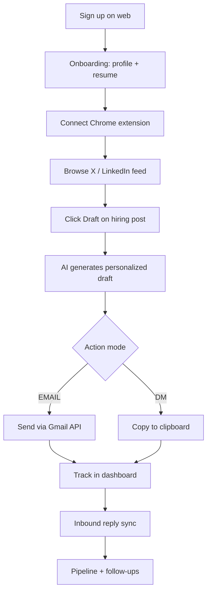

# Draft AI — Product Requirements Document

**Product:** Draft AI (repo: `recruit-ai`)  
**Last updated:** July 2026  
**Status:** Live core product; growth and hardening in progress

---

## 1. Problem Statement

Job seekers know that direct outreach to hiring managers and recruiters works, but they avoid it because:

- Crafting personalized messages is cognitively expensive and slow
- Generic templates feel inauthentic and shameful
- Silence after sending creates learned helplessness
- The job search itself is an identity threat

**Draft AI lowers the activation energy for socially risky outreach** while keeping the user in control: human-in-the-loop send, editable drafts, and reply tracking.

---

## 2. Target Users

### Primary — Active job seekers
- Software engineers, designers, PMs, and adjacent roles
- Already browsing X (Twitter) and LinkedIn for hiring posts
- Willing to send email or DM outreach if the message is good enough

### Secondary — Career bootcamps / coaches (future B2B)
- Need volume outreach tooling for cohorts
- Not yet fully productized; admin metrics exist as groundwork

---

## 3. Product Vision

> **One-click personalized outreach from the feed, sent from the user's own Gmail, with a dashboard that turns silence into a pipeline.**

Draft AI is **not** an auto-spam bot. Every send is user-reviewed. The extension assists; the user decides.

---

## 4. Core User Journey

### Step-by-step

1. **Discover** — User lands on marketing site (`/`) or `/try` demo
2. **Onboard** — Google sign-in (profile scope only initially), resume upload, skills, tone preferences
3. **Connect extension** — OAuth-style connect flow via `/extension/connect` + short-lived `ConnectToken`
4. **Draft from feed** — Content script injects "Draft" button on X/LinkedIn posts
5. **Review & send** — Side panel shows match score, subject/body, tone variants (Pro)
6. **Track outcomes** — Dashboard shows sent outreach, reply rate, streaks, pipeline stages
7. **Follow up** — Generate follow-up drafts; mark replies manually or via Gmail sync

---

## 5. Feature Requirements

### 5.1 Chrome Extension (`draft/`)

| Feature | Priority | Status | Notes |
|---------|----------|--------|-------|
| Feed "Draft" button on X/LinkedIn | P0 | Shipped | Per-post draft state in `draftsByPostId` |
| Side panel editor | P0 | Shipped | Edit subject/body, recipient email |
| Popup: auth, stats, weekly goal | P0 | Shipped | Streak ring, plan badge |
| Gmail send (via web API) | P0 | Shipped | Progressive Gmail consent on first send |
| DM copy-to-clipboard | P0 | Shipped | For posts without email |
| Offline queue for failed sends | P1 | Shipped | Retries via `chrome.alarms` |
| Sent-post deduplication | P0 | Shipped | Local + server sync |
| Tone variant generation | P1 | Shipped | Pro tier only |
| Firefox MV3 build | P2 | Partial | `build:firefox` script exists |

### 5.2 Web App (`web/`)

| Feature | Priority | Status | Notes |
|---------|----------|--------|-------|
| Google OAuth (NextAuth) | P0 | Shipped | Profile scope at sign-in |
| Progressive Gmail consent | P0 | Shipped | Full Gmail scopes on send/read |
| Candidate profile + resume extract | P0 | Shipped | UploadThing + PDF parsing |
| Onboarding (quick + full modes) | P0 | Shipped | Try-first flow at `/try` |
| Extension connect flow | P0 | Shipped | Hashed API keys, connect tokens |
| AI draft generation | P0 | Shipped | OpenAI gpt-4o-mini |
| Draft caching per post | P0 | Shipped | `PostDraft` unique on `userId + postId` |
| Gmail send | P0 | Shipped | RFC Message-ID for threading |
| Inbound email sync | P1 | Shipped | Gmail history API |
| Reply tracking + celebrations | P1 | Shipped | Confetti, milestones |
| Pipeline kanban (CRM-lite) | P1 | Shipped | `ConversationMeta` stages |
| Winning templates gallery | P1 | Shipped | Industry-tagged excerpts |
| Follow-up draft generation | P1 | Shipped | Basic+ tiers |
| Tone performance insights | P2 | Shipped | Pro tier |
| Weekly digest email | P2 | Shipped | Cron route |
| Billing (Dodo Payments) | P1 | Shipped | FREE / BASIC / PRO |
| Referral program | P2 | Shipped | Bonus draft credits |
| Admin metrics dashboard | P2 | Shipped | `/admin` |
| Account export + deletion | P1 | Shipped | GDPR-style lifecycle |
| SEO landing pages | P2 | Shipped | Persona + story routes |

### 5.3 AI / Intelligence

| Capability | Description |
|------------|-------------|
| Match scoring | 0–100 relevance score with fit highlights |
| Action mode detection | `EMAIL` vs `DM` based on post content |
| Industry classification | Tags drafts for template clustering |
| Tone control | professional / warm / direct / formal |
| Draft length | short (~80w) / medium (~150w) / long (~250w) |
| Suspicious output flagging | Server-side safety check on LLM output |
| Profile versioning | Cache invalidation when profile changes |

---

## 6. Monetization

### Plans (source of truth: `web/src/lib/plans.ts`)

| Tier | Price | Drafts/mo | Emails/mo | Key unlocks |
|------|-------|-----------|-----------|-------------|
| **FREE** | $0 | 10 | 10 | Professional tone, extension, reply tracking |
| **BASIC** | $19/mo | 100 | 1,000 | Warm tone, follow-ups, 5 templates, 25% top-up discount |
| **PRO** | $39/mo | 2,000* | 10,000* | All tones, tone variants, tone insights, unlimited templates |

\*Soft caps with fair-use policy

### Metering rules
- 1 draft generated (including variants and follow-ups) = 1 draft credit
- 1 email sent = 1 email credit
- Email send does **not** also deduct a draft credit
- Bonus credits (referrals, top-ups) consumed before hitting base cap
- Enforcement gated by `BILLING_ENFORCEMENT_ENABLED` env flag

### Trial
- 14-day trial starts on first email send (not signup)

### Top-up packs
- +200 emails ($8), +500 emails ($18), +50 drafts ($5)
- Basic tier gets 25% discount on top-ups

---

## 7. Success Metrics

### North-star
- **Weekly active outreach** — users who send ≥1 outreach per week

### Activation
- Signup → onboarding complete
- Onboarding complete → extension connected
- Extension connected → first draft generated
- First draft → first send

### Engagement
- Reply rate (7-day rolling)
- Current streak / weekly goal completion
- Drafts per active user per week

### Revenue
- Free → paid conversion
- MRR / ARPU
- Churn (cancel at period end)

### Quality
- Match score distribution
- Edit distance (user edits before send) — future
- NPS from in-app feedback

---

## 8. Non-Goals (Explicit)

- **Auto-send without user review** — violates trust and platform ToS
- **LinkedIn DM automation** — copy-only for DMs; no automated posting
- **Recruiter-side ATS** — candidate product only (recruiter page is marketing)
- **Multi-channel beyond X/LinkedIn + email** — no WhatsApp, SMS, etc.
- **Mobile native app** — extension + responsive web only

---

## 9. Trust, Privacy & Compliance

- User sends from **their own Gmail** — Draft AI is an assistant, not a relay
- API keys stored hashed server-side; extension holds plaintext key in `chrome.storage.local`
- Connect tokens are single-use, short-lived, bound to user
- Refresh tokens encrypted at rest (AES-256-GCM) in `MailboxSync`
- Account export (`GET /api/account/export`) and deletion (`DELETE /api/account`)
- Privacy policy and terms pages exist

---

## 10. Open Gaps / Roadmap

| Item | Phase | Priority |
|------|-------|----------|
| E2E tests in CI | P1 hardening | High |
| Chrome Web Store marketing assets | P1 brand | Medium |
| Job queue for async LLM/email | P3 scale | Medium |
| Bootcamp B2B pilot | P3 growth | Medium |
| Firefox extension publish | P3 growth | Low |
| Edit-distance analytics | Future | Low |

See `.cursor/plans/million-dollar_growth_roadmap_044e2fa0.plan.md` for phased execution history.

---

## 11. Key Files (Quick Reference)

| Area | Path |
|------|------|
| Extension feed injection | `draft/contents/feed.ts` |
| Extension side panel | `draft/sidepanel.tsx` |
| Extension background | `draft/background.ts` |
| AI draft API | `web/src/app/api/match-job/route.ts` |
| Send email API | `web/src/app/api/send-email/route.ts` |
| Entitlements | `web/src/lib/entitlements.ts`, `web/src/lib/plans.ts` |
| Database schema | `web/prisma/schema.prisma` |
| Onboarding | `web/src/app/onboarding/` |
| Dashboard | `web/src/app/dashboard/` |
