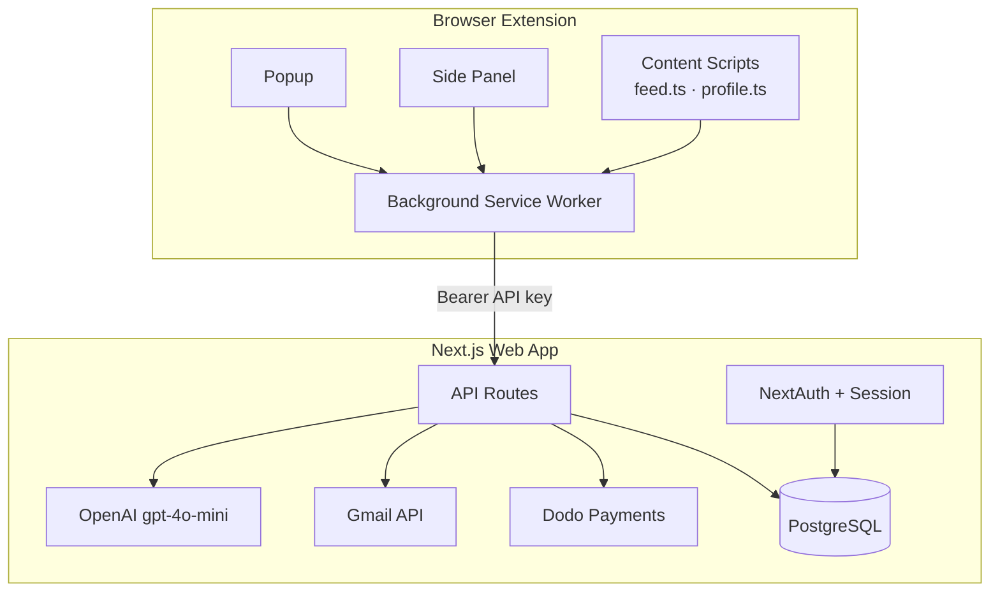

<h1 align="center">Draft AI</h1>

<p align="center">
  Personalized outreach, drafted from the feed, sent from your own Gmail.
</p>

<p align="center">
  <a href="#quick-start"><b>Quick start</b></a> ·
  <a href="#architecture"><b>Architecture</b></a> ·
  <a href="#features"><b>Features</b></a> ·
  <a href="#tech-stack"><b>Tech stack</b></a> ·
  <a href="#project-layout"><b>Layout</b></a>
</p>

---

## What is Draft AI

Job seekers know that direct outreach to hiring managers and recruiters works — but writing a good, personalized message for every hiring post you see on **X (Twitter)** or **LinkedIn** is slow, and generic templates feel inauthentic.

Draft AI removes that friction. A Chrome extension detects hiring posts in your feed, an AI assistant drafts a personalized pitch grounded in your resume and profile, you review and edit it in a side panel, and you send it from **your own Gmail account** — never a shared relay, never auto-sent. A web dashboard then turns the silence that follows into a trackable pipeline: replies, streaks, follow-ups, and a lightweight CRM.

> **Not an auto-spam bot.** Every send is a deliberate, human click. The extension assists; you decide.

### Core loop

```
Sign up → Onboard (resume + profile) → Connect extension → Browse X/LinkedIn
  → Click "Draft" on a hiring post → Review/edit in side panel
  → Send via Gmail or copy as DM → Track replies in dashboard → Follow up
```

---

## Architecture

Draft AI is a **monorepo** with two deployable surfaces. The extension is intentionally thin — all AI, persistence, auth, and third-party integration (Gmail, billing) live server-side in the web app.

| Package | Stack | Role |
|---|---|---|
| [`web/`](web) | Next.js 16, React 19, Prisma 7 + PostgreSQL | Auth, AI drafting, Gmail send/sync, billing, dashboard |
| [`draft/`](draft) | Plasmo (MV3), React 18 | Chrome extension: feed injection, side panel, popup |



The extension authenticates to the web app with a **hashed, revocable Bearer API key** (never OAuth tokens or LLM keys in the extension bundle). The web app owns the Google OAuth session, requests Gmail scopes progressively (only when the user actually sends or syncs mail), and enforces plan limits server-side before any AI call or Gmail send.

📄 **Full system design** — data flows, database schema, API surface, CI/CD — lives in [`architechture.md`](architechture.md). It's kept in sync with the actual codebase, not just the original design intent.

---

## Features

### Chrome extension
- **Feed "Draft" button** injected into X and LinkedIn hiring posts (shadow-DOM aware)
- **Side panel editor** — edit subject/body/recipient before sending, nothing goes out unreviewed
- **Popup** — auth status, sent/reply stats, weekly goal ring
- Gmail send *or* copy-to-clipboard for DM-only posts
- Offline queue with automatic retry (`chrome.alarms`)
- Local + server sent-post deduplication so you never draft the same post twice

### Web app
- Google sign-in with **progressive Gmail consent** (profile only at sign-up; Gmail scopes requested at first send)
- AI-assisted onboarding — resume upload → extraction → guided profile completion
- AI draft generation (match score, fit highlights, tone/length control, EMAIL vs. DM detection)
- Per-post draft caching, invalidated on profile changes
- Inbound reply sync via the Gmail History API, matched to sent threads
- Dashboard: draft/email/DM history, a pipeline Kanban (lightweight CRM), streaks & milestones, winning-template gallery, tone-performance insights, referrals, billing
- Account data export and deletion

### AI pipeline
Match scoring, action-mode (EMAIL/DM) detection, industry classification, configurable tone (professional / warm / direct / formal) and length, and a safety pass over every LLM output before it's persisted or sent.

---

## Tech stack

**Web** — Next.js 16 (App Router) · React 19 · TypeScript · Prisma 7 (`@prisma/adapter-pg`) · PostgreSQL · NextAuth (Google OAuth) · OpenAI (gpt-4o-mini) · Gmail API · Dodo Payments · UploadThing · Tailwind CSS v4 · Radix UI · Framer Motion · Sentry · Playwright

**Extension** — Plasmo (MV3) · React 18 · TypeScript · Tailwind CSS v3 · Framer Motion · Sentry

---

## Quick start

### Prerequisites
- Node.js 20+
- A local or hosted PostgreSQL instance
- Google Cloud OAuth credentials, an OpenAI API key, and (optionally) Dodo Payments / UploadThing / Sentry credentials for full functionality

### Web app

```bash
cd web
cp .env.example .env      # fill in DATABASE_URL, GOOGLE_*, OPENAI_API_KEY, etc.
npm install --legacy-peer-deps
npx prisma migrate deploy
npm run dev                # http://localhost:3000
```

### Chrome extension

```bash
cd draft
cp .env.example .env
# set PLASMO_PUBLIC_WEB_URL=http://localhost:3000
npm install
npm run dev                 # non-HMR watch build (stable content scripts)
# load draft/build/chrome-mv3-dev as an unpacked extension in chrome://extensions
```

Then in the extension: complete onboarding on the web app, connect the extension from your dashboard, and open X or LinkedIn to see the Draft button.

### Useful commands

| Command | Where | Does |
|---|---|---|
| `npm run dev` | `web/` | Start Next.js dev server |
| `npm run lint` | `web/` | ESLint |
| `npm test` | `web/` | Playwright e2e |
| `npm run test:unit` | `web/` | Unit tests for pure lib logic |
| `npm run dev` | `draft/` | Watch-build the extension |
| `npm run build && npm run package` | `draft/` | Production build + Chrome Web Store zip |
| `npm run build:firefox` | `draft/` | Firefox MV3 build |

---

## Project layout

```
recruit-ai/
├── web/                    # Next.js app — all server logic, DB, AI, Gmail, billing
│   ├── prisma/schema.prisma
│   ├── src/app/            # Pages + API routes (App Router)
│   ├── src/components/
│   ├── src/lib/            # AI, auth, billing, email — the business logic core
│   └── e2e/                # Playwright specs
├── draft/                  # Plasmo Chrome extension — thin client only
│   ├── contents/           # feed.ts, connect.ts, web-app.ts, profile.ts
│   ├── components/
│   ├── lib/
│   ├── background.ts
│   ├── sidepanel.tsx
│   └── popup.tsx
├── PRD.md                  # Product requirements
├── architechture.md        # System design, verified against code
└── rules.md                # Contributor / agent conventions
```

---

## Design principles

1. **Extension is dumb, server is smart** — no AI keys or business logic ship in the extension bundle
2. **Human-in-the-loop, always** — no auto-send, no bulk/scheduled outreach
3. **Cache aggressively** — one draft per post per user; avoid redundant LLM calls
4. **Progressive permissions** — request Gmail access only when it's actually needed
5. **Idempotent billing** — webhook events are deduplicated by provider event ID; checkout is guarded against duplicates

---

## Documentation

| Doc | Contents |
|---|---|
| [`PRD.md`](PRD.md) | Product requirements, user journeys, monetization, roadmap |
| [`architechture.md`](architechture.md) | System design — data flows, full DB schema, API surface, CI/CD |
| [`rules.md`](rules.md) | Where code goes, auth/billing/testing conventions, security checklist |

---

## Contributing

Read [`rules.md`](rules.md) before opening a PR — it covers where server-only vs. shared vs. extension-only code belongs, billing/entitlement conventions, and the security checklist for auth/email changes. Keep diffs scoped: one logical change per PR, and update the root docs alongside any architecture, pricing, or core-flow change.

## License

Proprietary — all rights reserved.
