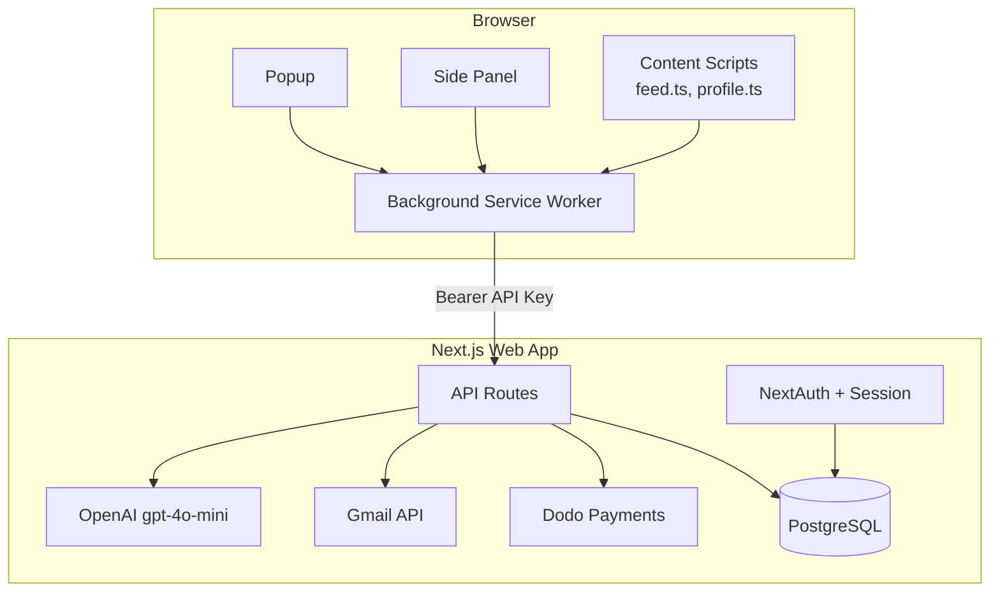
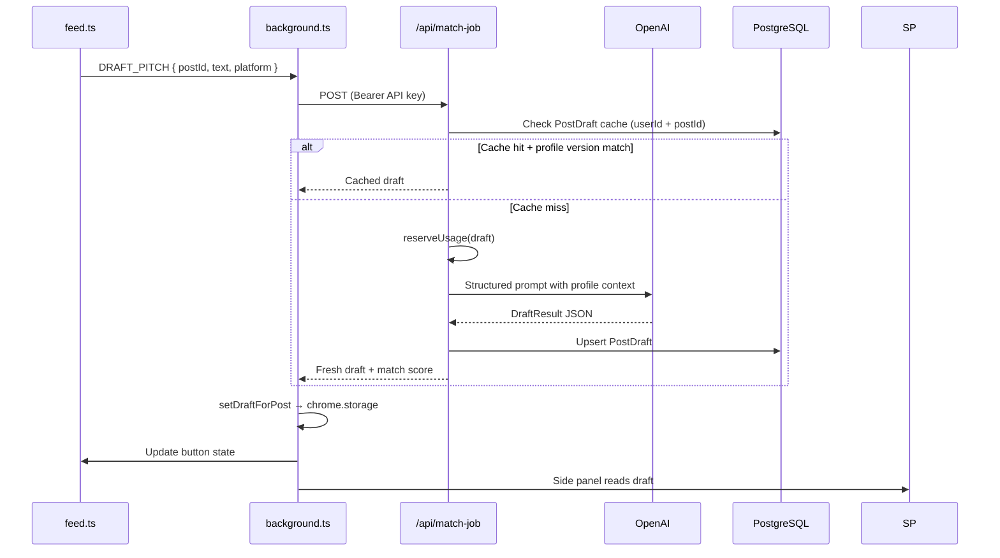
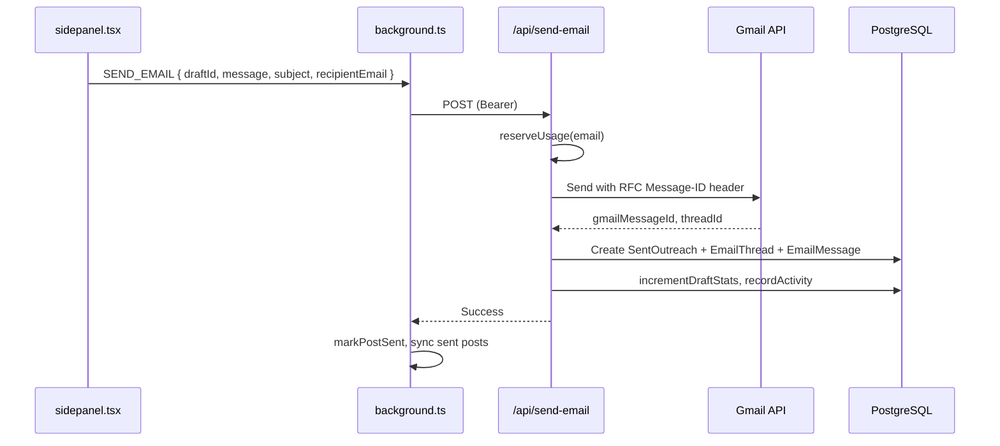

# Draft AI — Architecture

**Repo:** `recruit-ai`  
**Last updated:** July 2026

---

## 1. System Overview

Draft AI is a **monorepo** with two deployable surfaces:

| Package | Stack | Purpose |
|---------|-------|---------|
| `web/` | Next.js 16, React 19, Prisma, PostgreSQL | Auth, profile, AI, Gmail, billing, dashboard |
| `draft/` | Plasmo MV3, React 18 | Chrome extension for X/LinkedIn feed + side panel |

The extension is a thin client. All business logic, AI, persistence, and Gmail integration live in the web app.



---

## 2. Repository Layout

```
recruit-ai/
├── web/                    # Next.js web application
│   ├── prisma/             # Schema + migrations
│   ├── src/
│   │   ├── app/            # App Router pages + API routes
│   │   ├── components/     # React UI
│   │   ├── hooks/          # Client hooks
│   │   └── lib/            # Server + shared business logic
│   └── e2e/                # Playwright tests
├── draft/                  # Plasmo Chrome extension
│   ├── contents/           # Content scripts (feed, connect, web-app)
│   ├── components/         # Extension UI components
│   ├── lib/                # Extension-only utilities
│   ├── background.ts       # Service worker
│   ├── sidepanel.tsx       # Draft editor panel
│   └── popup.tsx           # Extension popup
├── PRD.md                  # Product requirements
├── architechture.md        # This file
└── rules.md                # Dev conventions
```

### Shared code pattern

The extension imports select utilities from the web app via relative paths:

```typescript
// draft/contents/feed.ts
import { extractEmailFromText } from "../../web/src/lib/email"
```

Keep shared modules **pure** (no server-only imports) when referenced from the extension.

---

## 3. Authentication & Authorization

### Web session (NextAuth)

- **Provider:** Google OAuth
- **Initial scopes:** `openid email profile` (no Gmail at sign-in)
- **Adapter:** Prisma (`User`, `Account`, `Session`)
- **Session callback:** attaches `user.id` to session

### Extension auth (API keys)

1. User completes onboarding on web
2. Extension opens `/extension/connect?state=<random>`
3. Web validates session + `ConnectToken` (single-use, expires)
4. Server creates hashed API key (`ApiKey` model) and returns plaintext once
5. Extension stores key in `chrome.storage.local`
6. All extension API calls use `Authorization: Bearer <apiKey>`

**Security properties:**
- Keys stored as SHA-256 hash server-side; only prefix shown in UI
- 401 from `/api/extension/status` clears extension auth (key rotation)
- Rate limiting per route via `bearer-auth.ts`
- Connect tokens prevent CSRF on extension pairing

### Gmail scopes (progressive consent)

- Sign-in: profile only
- First email send or mailbox sync: additional Gmail scopes via `gmail-consent.ts`
- Refresh tokens encrypted in `MailboxSync.encryptedRefreshToken`

---

## 4. Core Data Flow: Draft Generation



### DraftResult shape (`web/src/lib/outreach.ts`)

```typescript
{
  detected_name: string
  is_hiring_relevant: boolean
  match_score: number          // 0–100
  match_reason: string
  fit_highlights: string[]
  action_mode: "EMAIL" | "DM"
  outreach_payload: {
    subject_line: string | null
    message_content: string
  }
}
```

### Caching strategy

- Key: `(userId, postId)` unique constraint on `PostDraft`
- Invalidation: `profileVersion` hash from `CandidateProfile.updatedAt`
- Tone variants stored in `DraftVariant` (Pro tier)

---

## 5. Core Data Flow: Email Send



### Human-in-the-loop guarantee

The side panel requires explicit user action (Send button). No background auto-send.

### DM path

When `action_mode === "DM"`, user copies message to clipboard. `RECORD_OUTREACH` logs the send without Gmail.

---

## 6. Email Threading & Reply Sync

### Outbound threading headers

- Inject RFC 2822 `Message-ID` on send
- Store `rfcMessageId`, `gmailThreadId`, `gmailMessageId` on `SentOutreach`

### Inbound sync (`web/src/lib/email-sync/`)

1. Cron or manual trigger: `POST /api/mail-sync`
2. Gmail History API fetches changes since `MailboxSync.gmailHistoryId`
3. `thread-matcher.ts` links inbound messages to `SentOutreach` via Message-ID / In-Reply-To / References
4. Creates/updates `EmailThread` + `EmailMessage`
5. Marks `SentOutreach.responseReceivedAt`, updates reply stats

---

## 7. Database Schema (Key Models)

```
User
├── CandidateProfile      # Resume, skills, tone prefs, onboarding state
├── ApiKey              # Hashed extension keys
├── ConnectToken        # Short-lived extension pairing
├── PostDraft           # Cached AI drafts (per post)
│   └── DraftVariant    # Tone variants (Pro)
├── SentOutreach        # Sent messages + reply metadata
│   └── ConversationMeta  # Pipeline CRM fields
├── EmailThread
│   └── EmailMessage
├── MailboxSync         # Gmail sync cursor + encrypted refresh token
├── Subscription        # Dodo billing state
├── UsageLedger         # Per-period draft/email counts
├── UserStats           # Aggregated send/reply counters
├── UserEngagement      # Streaks, weekly goals
├── UserMilestone       # Achievement badges
├── WinningTemplate     # Saved high-performing excerpts
└── Referral            # Referral codes + bonus credits
```

Full schema: `web/prisma/schema.prisma`

---

## 8. API Surface

### Extension-authenticated (Bearer API key)

| Route | Method | Purpose |
|-------|--------|---------|
| `/api/match-job` | POST | Generate/cache draft |
| `/api/match-job/variant` | POST | Generate tone variant |
| `/api/send-email` | POST | Send via Gmail |
| `/api/record-outreach` | POST | Log DM/copy sends |
| `/api/extension/status` | GET | Validate key + profile state |
| `/api/extension/connect` | POST | Exchange connect token for API key |
| `/api/extension/sent-posts` | GET/POST | Sync sent post IDs |
| `/api/extension/heartbeat` | POST | Last-seen timestamp |
| `/api/extension/analytics` | GET | Popup stats |
| `/api/extension/engagement` | GET/PATCH | Streaks, weekly goal |
| `/api/extension/insights` | GET | Tone performance (Pro) |
| `/api/extension/mark-replied` | POST | Manual reply mark |

### Session-authenticated (NextAuth cookie)

| Route | Purpose |
|-------|---------|
| `/api/onboarding/extract-resume` | PDF → profile fields |
| `/api/follow-up-draft` | Generate follow-up |
| `/api/mail-sync` | Trigger inbox sync |
| `/api/billing/*` | Checkout, portal, webhooks, status |
| `/api/account` | Delete account |
| `/api/account/export` | Export user data |
| `/api/feedback` | NPS / comments |
| `/api/referral` | Referral code management |

### Cron (protected by secret)

| Route | Schedule | Purpose |
|-------|----------|---------|
| `/api/cron/weekly-digest` | Weekly | Engagement digest emails |
| `/api/cron/sync-winning-templates` | Periodic | Aggregate winning templates |

---

## 9. Billing Architecture

```mermaid
flowchart LR
  UI[Billing UI] --> Checkout[/api/billing/checkout]
  Checkout --> Dodo[Dodo Payments]
  Dodo --> Webhook[/api/billing/webhook]
  Webhook --> Sub[Subscription table]
  Webhook --> Event[SubscriptionEvent audit]
  API[Any metered API] --> Ent[entitlements.ts]
  Ent --> Ledger[UsageLedger]
  Ent --> Plans[plans.ts limits]
```

- **Provider:** Dodo Payments (not Stripe)
- **Idempotency:** `BillingEvent.id` = provider event ID
- **Concurrency guard:** `CheckoutIntent` unique per user prevents double checkout
- **Enforcement:** `BILLING_ENFORCEMENT_ENABLED=true` activates server-side limits
- **Pure logic:** `entitlements-core.ts` (unit-testable, no DB)

---

## 10. Extension Architecture

### Plasmo entry points

| File | Role |
|------|------|
| `background.ts` | Message router, API calls, offline queue, heartbeat |
| `contents/feed.ts` | Inject Draft buttons, popover preview, post detection |
| `contents/connect.ts` | Handle connect callback from web |
| `contents/web-app.ts` | Bridge when user is on web app domain |
| `contents/profile.ts` | LinkedIn profile page helpers |
| `sidepanel.tsx` | Full draft editor + send/copy |
| `popup.tsx` | Auth status, analytics, quick links |

### Extension storage keys

- Auth: API key, user email/name, connectedAt
- Drafts: `draftsByPostId`, `activePostId`
- Sent posts: local map synced with server
- Offline queue: failed API actions for retry

### Offline resilience

- `offline-queue.ts` enqueues retryable failures
- `chrome.alarms` every 5 min processes queue + polls analytics

### DOM injection

- `dom-query.ts` handles shadow DOM traversal on X/LinkedIn
- Platform detection via `platform.ts` (hostname-based)

---

## 11. AI Pipeline

| Step | Module |
|------|--------|
| Build system prompt | `draft-prompt.ts` |
| Profile context assembly | `candidate-profile.ts` |
| Industry tag | `industry-classifier.ts` |
| LLM call | `openai.ts` (gpt-4o-mini) |
| Parse + normalize | `outreach.ts` |
| Safety flag | `flagSuspiciousDraftOutput()` |
| Tone recommendation | `tone-recommendation.ts` |

Prompt inputs: candidate profile, post text, tone/length/language prefs, industry overrides.

---

## 12. Frontend Architecture (Web)

- **Router:** Next.js App Router (`web/src/app/`)
- **UI:** Radix primitives + Tailwind CSS v4
- **Motion:** Framer Motion with shared tokens (`motion-tokens.ts`)
- **Dashboard panels:** Drafts, emails, DMs, pipeline, templates, extension status
- **Marketing:** Server-rendered landing + SEO pages (`seo-content.ts`)

### Key routes

| Route | Purpose |
|-------|---------|
| `/` | Marketing home (redirects if authed) |
| `/onboarding` | Profile setup wizard |
| `/dashboard` | Main analytics hub |
| `/dashboard/pipeline` | Kanban CRM |
| `/dashboard/drafts` | Draft history |
| `/dashboard/emails` | Email threads |
| `/pricing` | Plan comparison |
| `/extension/connect` | Extension pairing page |

---

## 13. Observability & Errors

- **Sentry:** Web (`@sentry/nextjs`) + extension (`@sentry/browser`)
- **Error messages:** Centralized in `error-messages.ts` (web + extension)
- **API errors:** Structured codes mapped in `api-errors.ts`

---

## 14. Deployment

| Surface | Target | Notes |
|---------|--------|-------|
| Web | Vercel (typical) | `prisma migrate deploy` in build |
| Extension | Chrome Web Store | `npm run build && npm run package` |
| Database | PostgreSQL | Prisma 7 with `@prisma/adapter-pg` |
| Cron | Vercel Cron or external | Weekly digest, template sync |

### Environment coupling

- Extension: `PLASMO_PUBLIC_WEB_URL` must match deployed web origin
- Web: `.env.example` documents required vars (Google, OpenAI, Dodo, DB, Sentry)

---

## 15. CI/CD

| Workflow | Path | What it does |
|----------|------|--------------|
| CI | `.github/workflows/ci.yml` | Lint + build web |
| Extension submit | `.github/workflows/draft-submit.yml` | Chrome Web Store packaging |

**Gap:** Playwright e2e not yet in CI (tests exist in `web/e2e/`).

---

## 16. Design Principles

1. **Extension is dumb, server is smart** — No AI keys or business rules in the extension
2. **Human-in-the-loop** — User always reviews before send
3. **Cache aggressively** — Per-post drafts avoid redundant LLM calls
4. **Progressive permissions** — Ask for Gmail only when needed
5. **Pure entitlement logic** — Test limits without DB (`entitlements-core.ts`)
6. **Shared pure utils** — Email parsing, error codes cross the web/extension boundary
7. **Idempotent webhooks** — Billing events keyed by provider ID
