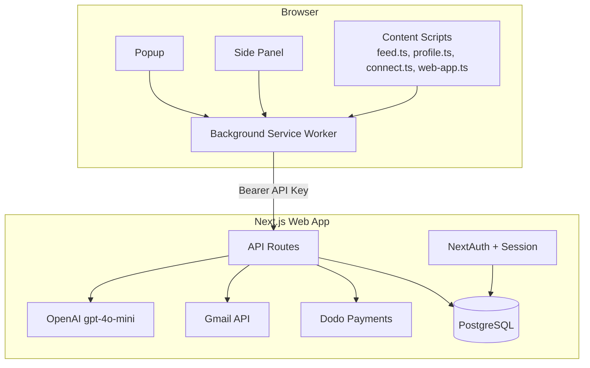
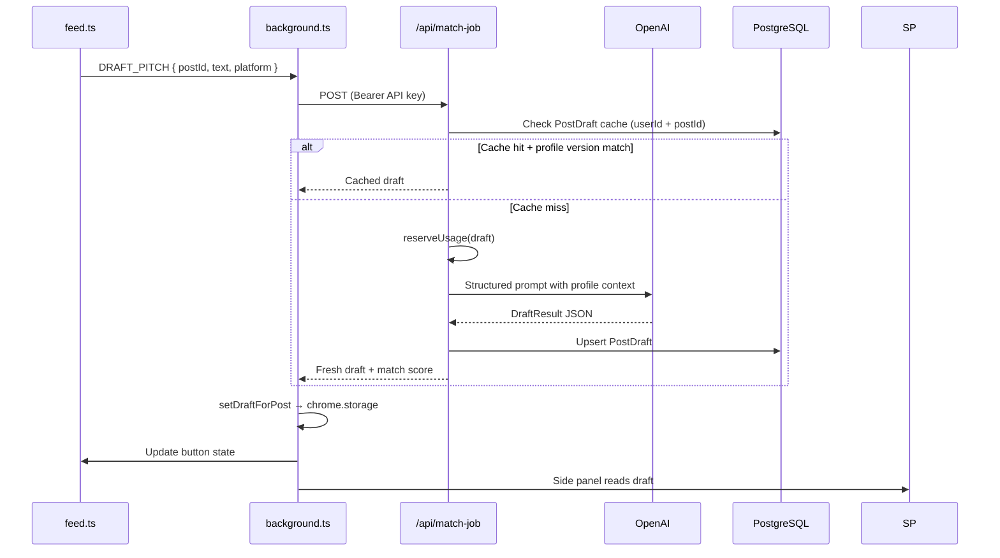
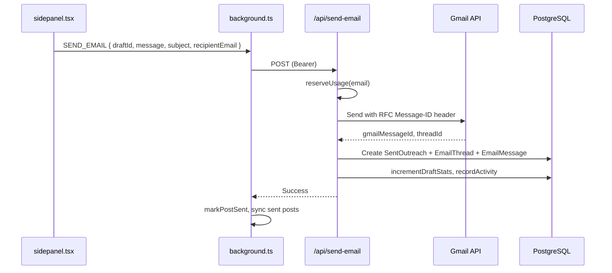

# Draft AI — Architecture

**Repo:** `recruit-ai`
**Last updated:** July 2026 (verified against codebase)

---

## 1. System Overview

Draft AI is a **monorepo** with two deployable surfaces:

| Package | Stack | Purpose |
|---------|-------|---------|
| `web/` | Next.js 16.2.10, React 19.2.4, Prisma 7.8.0 (`@prisma/adapter-pg`), PostgreSQL | Auth, profile, AI, Gmail, billing, dashboard |
| `draft/` | Plasmo 0.90.5 (MV3), React 18.2.0, Tailwind 3 | Chrome extension for X/LinkedIn feed + side panel |

The extension is a thin client. All business logic, AI, persistence, and Gmail integration live in the web app.



---

## 2. Repository Layout

```
recruit-ai/
├── web/                          # Next.js web application
│   ├── prisma/                   # Schema + migrations
│   ├── src/
│   │   ├── app/                  # App Router pages + API routes
│   │   │   ├── (marketing)/      # outreach, stories route group
│   │   │   ├── admin/            # Internal metrics dashboard
│   │   │   ├── onboarding/       # Profile setup wizard
│   │   │   ├── dashboard/        # pipeline, extension, drafts, emails, profile, templates, dms
│   │   │   ├── extension/connect/# Extension pairing page
│   │   │   ├── e2e/work-experience/ # Test-support route (Playwright scaffolding, not product UI)
│   │   │   ├── actions/          # Server actions for form mutations
│   │   │   └── api/              # Route handlers (see §8)
│   │   ├── components/           # React UI
│   │   ├── hooks/                # Client hooks
│   │   └── lib/                  # Server + shared business logic
│   └── e2e/                      # Playwright tests (12 spec files, not wired into CI — see §15)
├── draft/                        # Plasmo Chrome extension
│   ├── contents/                 # Content scripts (feed, connect, web-app, profile)
│   ├── components/               # Extension UI components (draft-ai-brand, status-banner)
│   ├── lib/                      # Extension-only utilities
│   ├── background.ts             # Service worker
│   ├── sidepanel.tsx             # Draft editor panel
│   └── popup.tsx                 # Extension popup
├── PRD.md                        # Product requirements
├── architechture.md              # This file
└── rules.md                      # Dev conventions
```

### Known dead / vestigial code

- `web/src/app/api/try-draft/` — empty directory, no `route.ts`. PRD's `/try` demo funnel does not exist as a route; treat PRD references to it as aspirational, not shipped.
- `HiringProfile` Prisma model — recruiter-side schema with no reads/writes in current candidate-only product. Likely leftover from an earlier pivot; don't build against it without confirming with the team.

### Shared code pattern

The extension imports select utilities from the web app via relative paths:

```typescript
// draft/contents/feed.ts
import { extractEmailFromText } from "../../web/src/lib/email"
```

Keep shared modules **pure** (no server-only imports) when referenced from the extension.

---

## 3. Authentication & Authorization

### Web session (NextAuth) — `web/src/lib/auth.ts`

- **Provider:** Google OAuth
- **Initial scopes:** `openid email profile` (no Gmail at sign-in)
- **Adapter:** Prisma (`User`, `Account`, `Session`, `VerificationToken`)
- **Session callback:** attaches `user.id` to session
- **Redirect callback:** origin-parsed (not string-prefix) — guards against open redirects

### Extension auth (API keys)

1. User completes onboarding on web
2. Extension opens `/extension/connect?state=<random>`
3. Web validates session + `ConnectToken` (single-use, expires)
4. Server creates hashed API key (`ApiKey` model) and returns plaintext once
5. Extension stores key in `chrome.storage.local`
6. All extension API calls use `Authorization: Bearer <apiKey>`

**Implementation (`web/src/lib/bearer-auth.ts`):** Bearer header → `validateApiKey()` → optional `rateLimit()` keyed `bearer:{scope}:{userId}`.

**Security properties:**
- Keys stored as SHA-256 hash server-side; only prefix shown in UI
- 401 from `/api/extension/status` clears extension auth (key rotation)
- Rate limiting per route via `bearer-auth.ts` + `rate-limit.ts`
- Connect tokens prevent CSRF on extension pairing (`connect/init` issues the token; `connect` exchanges it)

### Gmail scopes (progressive consent)

- Sign-in: profile only
- First email send or mailbox sync: additional Gmail scopes via `gmail-consent.ts`
- Refresh tokens encrypted (AES-256-GCM) in `MailboxSync.encryptedRefreshToken`

---

## 4. Core Data Flow: Draft Generation



### DraftResult shape (`web/src/lib/outreach.ts`)

```typescript
{
  detected_name: string
  is_hiring_relevant: boolean
  match_score: number          // 0–100
  match_reason: string
  fit_highlights: string[]
  action_mode: "EMAIL" | "DM"
  outreach_payload: {
    subject_line: string | null
    message_content: string
  }
}
```

### Caching strategy

- Key: `(userId, postId)` unique constraint on `PostDraft`
- Invalidation: `profileVersion` hash from `CandidateProfile.updatedAt`
- Tone variants stored in `DraftVariant` (Pro tier)

---

## 5. Core Data Flow: Email Send



### Human-in-the-loop guarantee

The side panel requires explicit user action (Send button). No background auto-send.

### DM path

When `action_mode === "DM"`, user copies message to clipboard. `RECORD_OUTREACH` logs the send without Gmail (0 usage meter).

---

## 6. Email Threading & Reply Sync

### Outbound threading headers

- Inject RFC 2822 `Message-ID` on send
- Store `rfcMessageId`, `gmailThreadId`, `gmailMessageId` on `SentOutreach`

### Inbound sync (`web/src/lib/email-sync/`)

Modules: `gmail-sync.ts`, `inbound-processor.ts`, `thread-matcher.ts`, `token-manager.ts`

1. Cron or manual trigger: `POST /api/mail-sync` (single mailbox) or `GET /api/mail-sync/all` (batch)
2. Gmail History API fetches changes since `MailboxSync.gmailHistoryId` (`gmail-sync.ts`, `token-manager.ts` handles refresh)
3. `inbound-processor.ts` normalizes fetched messages
4. `thread-matcher.ts` links inbound messages to `SentOutreach` via Message-ID / In-Reply-To / References
5. Creates/updates `EmailThread` + `EmailMessage`
6. Marks `SentOutreach.responseReceivedAt`, updates reply stats

---

## 7. Database Schema (Full Model List)

Source of truth: `web/prisma/schema.prisma`. Verified full model list:

```
User
├── Account, Session, VerificationToken   # NextAuth (Prisma adapter)
├── CandidateProfile      # Resume, skills, tone prefs, onboarding state
├── ApiKey                # Hashed extension keys
├── ConnectToken          # Short-lived extension pairing
├── PostDraft              # Cached AI drafts (per post)
│   └── DraftVariant       # Tone variants (Pro)
├── SentOutreach            # Sent messages + reply metadata
│   └── ConversationMeta    # Pipeline CRM fields
├── EmailThread
│   └── EmailMessage
├── MailboxSync            # Gmail sync cursor + encrypted refresh token
├── Subscription            # Dodo billing state (dodoCustomerId, dodoSubscriptionId,
│                            #   previousDodoSubscriptionId, scheduledTier/scheduledChangeAt)
├── UsageLedger             # Per-period draft/email counts + bonusDrafts/bonusEmails
├── BillingEvent             # Webhook idempotency, keyed by provider event id
├── SubscriptionEvent         # Full subscription lifecycle audit trail
├── CheckoutIntent            # Unique-per-user, prevents duplicate checkout
├── UserStats                # Aggregated send/reply counters
├── UserEngagement           # Streaks, weekly goals
├── UserMilestone             # Achievement badges
├── WinningTemplate           # Saved high-performing excerpts
├── Referral                 # Referral codes + bonus credits
├── Feedback                 # NPS / comments (`context` field, e.g. "post_trial" — string literal only)
└── HiringProfile             # Recruiter-side model — appears unused by current product (see §2)
```

**Enums:** `PlanTier` (`FREE` / `BASIC` / `PRO`), `SubscriptionStatus` (`ACTIVE` / `PAST_DUE` / `CANCELED` / `INCOMPLETE`)

**Trial period: confirmed removed from code.** No trial-window logic exists in `entitlements.ts`, `entitlements-core.ts`, or `plans.ts`. The only trace is the string `"post_trial"` as a `Feedback.context` value — not active logic. PRD.md §6 ("14-day trial starts on first email send") is stale documentation and should not be treated as current behavior.

Full schema: `web/prisma/schema.prisma`

---

## 8. API Surface

Verified route count: **33** handlers under `web/src/app/api/`.

### Extension-authenticated (Bearer API key)

| Route | Method | Purpose |
|-------|--------|---------|
| `/api/match-job` | POST | Generate/cache draft |
| `/api/match-job/variant` | POST | Generate tone variant |
| `/api/send-email` | POST | Send via Gmail |
| `/api/record-outreach` | POST | Log DM/copy sends |
| `/api/extension/status` | GET | Validate key + profile state |
| `/api/extension/connect/init` | POST | Issue connect token/state |
| `/api/extension/connect` | POST | Exchange connect token for API key |
| `/api/extension/sent-posts` | GET/POST | Sync sent post IDs |
| `/api/extension/heartbeat` | POST | Last-seen timestamp |
| `/api/extension/analytics` | GET | Popup stats |
| `/api/extension/engagement` | PATCH | Streaks, weekly goal |
| `/api/extension/insights` | GET | Tone performance (Pro) |
| `/api/extension/mark-replied` | POST | Manual reply mark |

### Session-authenticated (NextAuth cookie)

| Route | Method | Purpose |
|-------|--------|---------|
| `/api/onboarding/extract-resume` | POST | PDF → profile fields |
| `/api/onboarding/suggest-skills` | POST | AI skill suggestions |
| `/api/follow-up-draft` | POST | Generate follow-up |
| `/api/mail-sync` | POST/GET | Trigger inbox sync (single mailbox) |
| `/api/mail-sync/all` | GET | Batch sync across mailboxes |
| `/api/billing/checkout` | POST/DELETE | Start / cancel checkout |
| `/api/billing/change-plan` | POST | Upgrade/downgrade without new checkout |
| `/api/billing/portal` | POST | Dodo customer portal link |
| `/api/billing/webhook` | POST | Dodo webhook receiver |
| `/api/billing/status` | GET | Current plan/usage status |
| `/api/billing/sync` | POST | Manual reconciliation with Dodo |
| `/api/account` | DELETE | Delete account |
| `/api/account/export` | GET | Export user data |
| `/api/feedback` | POST | NPS / comments |
| `/api/referral` | GET/POST | Referral code management |
| `/api/engagement` | GET | Web dashboard engagement data |
| `/api/engagement/celebrations/consume` | POST | Mark celebration shown |
| `/api/uploadthing` | — | UploadThing file upload handler |

### Cron (protected by secret)

| Route | Method | Purpose |
|-------|--------|---------|
| `/api/cron/weekly-digest` | GET | Engagement digest emails |
| `/api/cron/sync-winning-templates` | GET | Aggregate winning templates |

### Dead

- `/api/try-draft/` — empty directory, no handler.

---

## 9. Billing Architecture

```mermaid
flowchart LR
  UI[Billing UI] --> Checkout[/api/billing/checkout]
  Checkout --> CI[CheckoutIntent<br/>unique per user]
  Checkout --> Dodo[Dodo Payments]
  Dodo --> Webhook[/api/billing/webhook]
  Webhook --> BE[BillingEvent<br/>idempotency by provider id]
  Webhook --> Sub[Subscription table]
  Webhook --> Event[SubscriptionEvent audit]
  ChangePlan[/api/billing/change-plan] --> Sub
  API[Any metered API] --> Ent[entitlements.ts]
  Ent --> Ledger[UsageLedger]
  Ent --> Plans[plans.ts limits]
```

- **Provider:** Dodo Payments (not Stripe)
- **Tiers:** FREE $0 (10 drafts / 10 emails, Professional tone only), BASIC $19/mo (100 drafts / 1,000 emails, + Warm tone), PRO $39/mo (2,000 drafts / 10,000 emails, soft caps, all 4 tones + variants + insights)
- **Top-ups:** email_200 ($8, $6 Basic), email_500 ($18, $13.50 Basic), draft_50 ($5, $3.75 Basic) — 25% Basic discount via `topUpPriceFor()`
- **Idempotency:** `BillingEvent.id` = provider event ID
- **Concurrency guard:** `CheckoutIntent` unique per user prevents double checkout
- **Plan changes:** `/api/billing/change-plan` updates `Subscription.scheduledTier`/`scheduledChangeAt` without a new checkout flow — added after a duplicate-subscription incident (multiple Dodo subscriptions charged same day)
- **Enforcement:** `BILLING_ENFORCEMENT_ENABLED=true` activates server-side limits
- **Pure logic:** `entitlements-core.ts` (unit-testable, no DB)
- **No trial period** — see §7

---

## 10. Extension Architecture

### Plasmo entry points

| File | Role |
|------|------|
| `background.ts` | Message router, API calls, offline queue, heartbeat |
| `contents/feed.ts` | Inject Draft buttons, popover preview, post detection |
| `contents/connect.ts` | Handle connect callback from web |
| `contents/web-app.ts` | Bridge when user is on web app domain |
| `contents/profile.ts` | LinkedIn profile page helpers |
| `sidepanel.tsx` | Full draft editor + send/copy |
| `popup.tsx` | Auth status, analytics, quick links |

### Shared UI primitives (`draft/components/`)

- `draft-ai-brand.tsx` — brand mark
- `status-banner.tsx` — shared `<StatusBanner>` (success/error/info tones, framer-motion fade+slide, uses literal Tailwind class names so JIT tree-shaking doesn't strip them); used by both `popup.tsx` and `sidepanel.tsx`

### Extension libs (`draft/lib/`)

`api-errors.ts`, `auth.ts`, `config.ts`, `dom-query.ts`, `draft-sync.ts`, `draft.ts`, `error-messages.ts`, `extension-context.ts`, `offline-queue.ts`, `platform.ts`, `sent-posts.ts`, `sentry.ts`, `utils.ts`

### Extension storage keys

- Auth: API key, user email/name, connectedAt
- Drafts: `draftsByPostId`, `activePostId`
- Sent posts: local map synced with server
- Offline queue: failed API actions for retry

### Offline resilience

- `offline-queue.ts` enqueues retryable failures
- `chrome.alarms` every 5 min processes queue + polls analytics

### DOM injection

- `dom-query.ts` handles shadow DOM traversal on X/LinkedIn
- Platform detection via `platform.ts` (hostname-based)
- `minimum_chrome_version: "114"` for side panel API

### Firefox

`build:firefox` script (`plasmo build --target=firefox-mv3`) and `browser_specific_settings.gecko` are present in the manifest — more concretely scaffolded than "not started," but not yet published to a store.

---

## 11. AI Pipeline

| Step | Module |
|------|--------|
| Build system prompt | `draft-prompt.ts` |
| Profile context assembly | `candidate-profile.ts` |
| Industry tag | `industry-classifier.ts` |
| LLM call | `openai.ts` (gpt-4o-mini) |
| Parse + normalize | `outreach.ts` |
| Outreach metadata / state | `outreach-metadata.ts`, `outreach-state.ts` |
| Send metadata resolution | `resolve-send-metadata.ts` |
| Skill suggestions | `skill-suggest.ts` |
| Tone entitlement gating | `tone-entitlements.ts` |
| Tone recommendation | `tone-recommendation.ts` |
| Follow-up generation | `follow-up-draft.ts` (own API route) |

All modules live in `web/src/lib/`. Prompt inputs: candidate profile, post text, tone/length/language prefs, industry overrides. Safety flag: `flagSuspiciousDraftOutput()` runs before persisting any LLM output.

---

## 12. Frontend Architecture (Web)

- **Router:** Next.js App Router (`web/src/app/`)
- **UI:** Radix primitives + Tailwind CSS v4
- **Motion:** Framer Motion with shared tokens (`motion-tokens.ts`)
- **Dashboard panels:** pipeline, extension, drafts, emails, profile, templates, dms
- **Marketing:** Server-rendered landing + SEO pages under `(marketing)/` route group

### Route tree (verified)

| Route | Purpose |
|-------|---------|
| `/` | Marketing home (redirects if authed) |
| `/(marketing)/outreach` | SEO/persona page |
| `/(marketing)/stories` | SEO/story routes |
| `/onboarding` | Profile setup wizard |
| `/dashboard` | Main analytics hub |
| `/dashboard/pipeline` | Kanban CRM |
| `/dashboard/extension` | Extension connection status |
| `/dashboard/drafts` | Draft history |
| `/dashboard/emails` | Email threads |
| `/dashboard/profile` | Profile editor |
| `/dashboard/templates` | Winning templates gallery |
| `/dashboard/dms` | DM history |
| `/pricing` | Plan comparison |
| `/extension/connect` | Extension pairing page |
| `/admin` | Internal metrics dashboard |
| `/privacy-policy`, `/terms-of-service` | Legal |
| `/recruiters` | Enterprise recruiter landing (marketing only) |
| `/e2e/work-experience` | Playwright test scaffolding — not product UI |

Note: PRD's `/try` demo funnel has no corresponding route (`app/api/try-draft/` is an empty dead directory) — treat as not shipped.

---

## 13. Observability & Errors

- **Sentry:** Web (`@sentry/nextjs` ^10.64.0) + extension (`@sentry/browser` ^9.47.1)
- **Error messages:** Centralized in `error-messages.ts` (web + extension)
- **API errors:** Structured codes mapped in `api-errors.ts`

---

## 14. Deployment

| Surface | Target | Notes |
|---------|--------|-------|
| Web | Vercel (typical) | `prisma migrate deploy` in build |
| Extension | Chrome Web Store | `npm run build && npm run package` → `draft/build/chrome-mv3-prod.zip` |
| Database | PostgreSQL | Prisma 7.8.0 with `@prisma/adapter-pg` |
| Cron | Vercel Cron or external | Weekly digest, template sync (GET handlers, secret-protected) |

### Environment coupling

- Extension: `PLASMO_PUBLIC_WEB_URL` must match deployed web origin
- Web: `.env.example` documents required vars (Google, OpenAI, Dodo, DB, Sentry, UploadThing)

---

## 15. CI/CD

| Workflow | Path | What it does |
|----------|------|--------------|
| CI | `.github/workflows/ci.yml` | Two jobs: `web` (Postgres 16 service container, `npm ci --legacy-peer-deps`, lint, `prisma generate`, `next build` with inline fake env vars — no real secrets needed) and `draft-extension` (`npm ci`, `npm run build`; no lint/test step) |
| Extension submit | `.github/workflows/draft-submit.yml` | Manual `workflow_dispatch`: build → `plasmo package` → publish via `PlasmoHQ/bpp@v3` using `SUBMIT_KEYS` secret |

**Confirmed gap:** Playwright e2e (`web/e2e/`, 12 spec files) is not wired into `ci.yml` — no step runs it. Extension also has no automated test/lint step in CI.

---

## 16. Design Principles

1. **Extension is dumb, server is smart** — No AI keys or business rules in the extension
2. **Human-in-the-loop** — User always reviews before send
3. **Cache aggressively** — Per-post drafts avoid redundant LLM calls
4. **Progressive permissions** — Ask for Gmail only when needed
5. **Pure entitlement logic** — Test limits without DB (`entitlements-core.ts`)
6. **Shared pure utils** — Email parsing, error codes cross the web/extension boundary
7. **Idempotent webhooks** — Billing events keyed by provider ID
