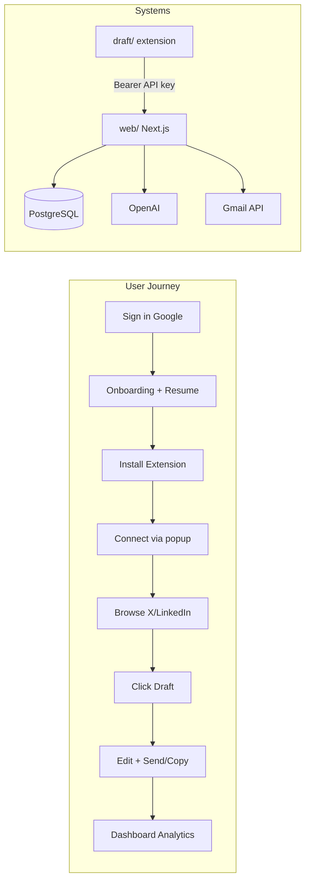
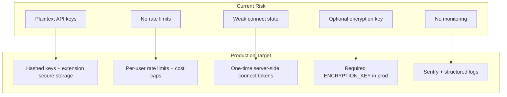

# Draft AI: Production Readiness & Million-Dollar Roadmap

## What You Have Today

**Draft AI** is an AI-powered job-seeker outreach product: a **Chrome extension** ([`draft/`](draft/)) injects "Draft" buttons on X and LinkedIn feed posts; a **Next.js web app** ([`web/`](web/)) handles auth, profile/resume setup, draft generation (OpenAI), Gmail send, and analytics.

### Working and solid

| Area | Status | Key files |
|------|--------|-----------|
| Google OAuth + DB sessions | Production-capable | [`web/src/lib/auth.ts`](web/src/lib/auth.ts) |
| Multi-step onboarding + resume AI extraction | Complete | [`web/src/app/onboarding/`](web/src/app/onboarding/) |
| Extension draft generation | Complete | [`web/src/app/api/match-job/route.ts`](web/src/app/api/match-job/route.ts) |
| Gmail outbound + resume attach | Complete | [`web/src/app/api/send-email/route.ts`](web/src/app/api/send-email/route.ts) |
| Email inbox sync (cron every 5 min) | Complete | [`web/vercel.json`](web/vercel.json), [`web/src/lib/email-sync/`](web/src/lib/email-sync/) |
| X + LinkedIn feed injection | Complete (fragile) | [`draft/contents/feed.ts`](draft/contents/feed.ts) |
| Popup, side panel, inline popover | Complete | [`draft/popup.tsx`](draft/popup.tsx), [`draft/sidepanel.tsx`](draft/sidepanel.tsx) |
| Sent-post deduplication | Complete | [`draft/lib/sent-posts.ts`](draft/lib/sent-posts.ts) |
| Marketing landing page | Polished | [`web/src/components/marketing/marketing-home.tsx`](web/src/components/marketing/marketing-home.tsx) |
| Privacy policy | Present | [`web/src/app/privacy-policy/page.tsx`](web/src/app/privacy-policy/page.tsx) |

**Verdict:** Strong MVP core — the "draft from post + resume" loop works end-to-end. Not yet a trustworthy, scalable SaaS.

---

## Broken & Missing Features (Complete Inventory)

### P0 — User-facing broken today

| Issue | Impact | Location |
|-------|--------|----------|
| Dashboard "Configure" links to `/extension/connect` **without `?state=`** | Shows "Missing connection link" — dead end | [`web/src/app/dashboard/page.tsx`](web/src/app/dashboard/page.tsx) ~702, 718 |
| Local dev connect **disabled** (localhost matches commented out) | Developers cannot test auth flow locally | [`draft/contents/connect.ts`](draft/contents/connect.ts) lines 11–12 |
| Integration cards always show **"Connected"** | False confidence; Gmail may be broken, extension may be disconnected | [`web/src/app/dashboard/page.tsx`](web/src/app/dashboard/page.tsx) ~679–723 |
| Gmail **"Manage" button has no handler** | Dead UI | same file ~687 |
| Marketing promises **"tone you control"** but Preferences tab is **static badges** (not persisted) | Feature lie erodes trust | dashboard ~545–576 |
| Marketing promises **LinkedIn profile** outreach; extension only works on **feed posts** | Expectation mismatch | marketing vs [`draft/contents/feed.ts`](draft/contents/feed.ts) |
| `matchInsight` (score, reason) computed but **never shown** in extension UI | Wasted value; no "why this draft" transparency | [`draft/sidepanel.tsx`](draft/sidepanel.tsx) |
| "View draft" reads **global** `currentDraft`, not per-post | Wrong draft when multiple posts drafted | [`draft/contents/feed.ts`](draft/contents/feed.ts) |
| No `twitter.com` in manifest | Users on legacy URL get no buttons | [`draft/package.json`](draft/package.json) manifest block |
| API key regenerate on dashboard **does not notify extension** | Silent 401s until user reconnects | [`web/src/app/actions.ts`](web/src/app/actions.ts) + extension auth |

### P1 — Missing for production

| Gap | Notes |
|-----|-------|
| **Zero automated tests** | No test script in [`web/package.json`](web/package.json) |
| **No `.env.example` or real README** | [`web/README.md`](web/README.md) is still create-next-app boilerplate |
| **No billing / subscription** | No Stripe, no usage limits, no monetization path |
| **No rate limiting** on extension APIs | Abuse + cost risk on `/api/match-job`, `/api/send-email` |
| **No error monitoring** (Sentry, etc.) | Only `console.error` |
| **Account deletion / data export** | Promised in privacy policy, not implemented |
| **`HiringProfile` model exists, no UI** | Dead schema surface | [`web/prisma/schema.prisma`](web/prisma/schema.prisma) |
| **No Chrome Web Store listing assets** | CI workflow may fail (`pnpm` vs `npm` lockfile mismatch) | [`draft/.github/workflows/submit.yml`](draft/.github/workflows/submit.yml) |
| **No Firefox extension** | Chrome-only limits TAM |
| **No options page** in extension | Plasmo scaffold exists, no `options.tsx` |
| **Onboarding not server-protected** | Only client `useSession()` guard; not in [`web/src/proxy.ts`](web/src/proxy.ts) matcher |
| **API keys stored plaintext** | DB + `chrome.storage.local` | [`web/prisma/schema.prisma`](web/prisma/schema.prisma), [`draft/lib/auth.ts`](draft/lib/auth.ts) |
| **Connect state not server-validated** | Any authenticated user can get API key with any UUID | [`web/src/app/api/extension/connect/route.ts`](web/src/app/api/extension/connect/route.ts) |

### P2 — Polish / debt

- Dashboard is a **860-line monolith** with no deep-linkable sections (`/dashboard?section=emails`)
- Loading skeleton layout **mismatches** actual dashboard ([`loading.tsx`](web/src/app/dashboard/loading.tsx) vs [`page.tsx`](web/src/app/dashboard/page.tsx))
- Naming drift: repo `recruit-ai`, product `Draft AI`, message type `RECRUIT_PITCH_AUTH`, key prefix `rp_`
- `cacheHits * 1200` token estimate is **heuristic**, not real metering
- Logo is **"DA" initials placeholder**, not a real brand mark ([`web/src/components/draft-ai-logo.tsx`](web/src/components/draft-ai-logo.tsx))
- No `brand_assets/` folder despite design rules referencing it

---

## Color Scheme & Visual Design Audit

### Current palette

Both apps share primary **`#1447e6`** (custom blue — good, avoids default Tailwind indigo).

| Token | Light | Dark (unused) |
|-------|-------|---------------|
| Primary | `#1447e6` | `#5085fb` |
| Background | `#ffffff` | `#141c30` |
| Muted | `#e5e7eb` / `#737373` | defined but no toggle |
| Charts | Orange/teal/navy palette | Used in stat cards |

**Sources:** [`web/src/app/globals.css`](web/src/app/globals.css), [`draft/theme.css`](draft/theme.css)

### Design inconsistencies

1. **Marketing vs dashboard brand** — Marketing uses Feather icon wordmark; dashboard/sidebar uses different "DA" box logo. Users see two brands.
2. **Font conflict** — `layout.tsx` loads Inter + Merriweather via `next/font`, but `globals.css` `:root` overrides with system font stacks. Headings may not render as intended.
3. **Dark mode tokens exist, no toggle** — Half-built; either ship dark mode or remove dead CSS.
4. **Extension inline popover uses vanilla CSS**; popup/sidepanel use Tailwind — visual drift between in-page UI and extension chrome.
5. **`transition-all` violations** — Present in dashboard, sidebar, progress (conflicts with project design guardrails in [`web/CLAUDE.md`](web/CLAUDE.md)).
6. **Secondary/muted are identical gray** (`#e5e7eb`) — weak visual hierarchy on cards and borders.
7. **No real logo, no brand guide** — Hard to build Chrome Store presence, social proof, or press coverage without a cohesive identity.

### Recommended design direction

- Create `brand_assets/` with logo (SVG), wordmark, and 3–5 color tokens
- Unify wordmark across marketing, dashboard, extension popup, and Chrome Store
- Fix font cascade so Merriweather headings + Inter body apply everywhere
- Add color-tinted shadows (per guardrails) instead of flat `shadow-sm`
- Either ship dark mode for extension power-users or delete `.dark` tokens

---

## Broken UI (Specific Fixes)

| UI element | Problem | Fix |
|------------|---------|-----|
| Extension connect from dashboard | Broken link | Remove misleading links OR deep-link to "open extension popup" instructions; never link to `/extension/connect` without state |
| Integration status cards | Always green "Connected" | Query real state: extension `/api/extension/status`, Gmail token health from `MailboxSync` |
| Preferences section | Static, non-editable | Wire to DB fields or remove from nav until built |
| Dashboard section nav | No URL state | Add `?section=` or sub-routes so refresh preserves context |
| Onboarding loading | Client-only auth flash | Add server layout guard |
| Extension popover on LinkedIn | DOM churn breaks injection | Add fallback UI ("Draft AI couldn't find this post — open side panel") + telemetry on selector misses |
| Popup when disconnected | Only "Connect account" | Add numbered setup checklist (install → sign in → connect → try first draft) |

---

## Psychological Barriers & UX Friction

These are the **non-technical** reasons users abandon the product — often more important than bugs for conversion.

### 1. Fear of sounding like a bot
- **Barrier:** Job seekers fear AI outreach feels spammy or gets them blocked.
- **Today:** Marketing shows a great before/after, but the product never surfaces *why* the draft is good (`matchInsight` hidden).
- **Fix:** Show "References: [post detail] + [your experience]" chips in side panel; add "sounds like me" tone slider that actually persists; optional "humanize" pass before send.

### 2. Permission anxiety (Google + extension)
- **Barrier:** OAuth asks for Gmail send/read — users wonder what you're doing with their inbox.
- **Today:** Privacy policy exists but onboarding doesn't explain scopes inline.
- **Fix:** Scope explainer step in onboarding ("We only send emails you approve"; "We sync replies to track conversations"); progressive permission (profile first, Gmail only when first email send attempted).

### 3. Setup fatigue before first win
- **Barrier:** Resume upload → AI extraction → profile edit → install extension → connect → find a post → draft = **6 steps** before value.
- **Fix:** "Quick start" path: paste LinkedIn URL or sample post in web app → generate one draft without extension → then upsell extension for in-feed workflow. Show time-to-first-draft metric in onboarding.

### 4. Cold outreach shame
- **Barrier:** Reaching out feels desperate; users procrastinate.
- **Fix:** Reframe copy from "outreach" to "starting conversations" / "researching companies"; show reply-rate stats (even anonymized benchmarks); celebrate small wins ("3 thoughtful messages this week").

### 5. Trust erosion from broken UI
- **Barrier:** False "Connected" badges and dead buttons teach users the product lies.
- **Fix:** P0 integrity fixes above — honest status beats optimistic UI.

### 6. Platform ToS anxiety
- **Barrier:** Users worry LinkedIn/X will ban them for automation.
- **Fix:** Clear positioning: "human-in-the-loop, you click send, we don't auto-DM"; document what the extension does *not* do (no mass messaging, no profile scraping bots).

### 7. No social proof
- **Barrier:** Landing page stats are product features ("~2s", "2 platforms"), not user outcomes.
- **Fix:** Add testimonials, reply-rate improvements, "used by X job seekers" (even beta cohort); Chrome Store reviews once published.

### 8. API key confusion
- **Barrier:** Non-technical users don't know what an "API key" is.
- **Fix:** Rename to "Extension link code" in UI; hide raw key behind "Copy connection code"; auto-connect flow should be the only path — dashboard key management is for power users only.

### 9. Regenerate key surprise
- **Barrier:** User regenerates key in dashboard, extension silently breaks.
- **Fix:** Confirm dialog + push `DISCONNECT` event to extension via polling or "extension heartbeat" endpoint.

### 10. No pricing clarity
- **Barrier:** Users won't invest setup time if they don't know cost.
- **Fix:** Free tier (e.g. 10 drafts/month) + visible pricing before onboarding completes.

---

## Security & Production Hardening

**Must-ship checklist:**
- `.env.example` + deployment runbook
- Rate limiting on all Bearer-authenticated routes
- Server-side connect token store (TTL 10 min, one-time use)
- Hash API keys at rest; show prefix only in UI
- Require `ENCRYPTION_KEY`, `NEXTAUTH_SECRET` at startup
- CSP + security headers in [`web/next.config.ts`](web/next.config.ts)
- Sentry (or equivalent) on web + extension error boundaries
- CI: lint + build + tests on every PR
- GDPR: account delete + data export endpoints

---

## Million-Dollar Strategy (Product + Business)

### The opportunity
**Job search is broken for proactive candidates.** In a competitive market, personalized outreach beats spray-and-pray applications. Draft AI sits at the intersection of:
- Chrome extension distribution (low CAC, high retention if habit-forming)
- AI personalization (defensible if reply-rate data compounds)
- Gmail-native send (replies stay in user's inbox — sticky)

Comparable spaces: Huntr, Teal, Simplify (application tracking); Apollo/Lemlist (sales outreach). **Draft AI's wedge is job-seeker-specific, in-feed, resume-aware drafting** — not another ATS or LinkedIn Premium clone.

### Monetization model (recommended)

| Tier | Price | Limits | Value |
|------|-------|--------|-------|
| Free | $0 | 10 drafts/mo, 3 emails/mo | Taste the magic |
| Pro | $19–29/mo | Unlimited drafts, 100 emails/mo | Active job seekers |
| Power | $49/mo | Higher email limits, priority AI, analytics | Career changers, bootcamp grads |

Add **annual discount** and **14-day Pro trial** after first successful draft (hook moment).

### Moats to build

1. **Reply-rate optimization loop** — Track which drafts get replies; fine-tune prompts per industry/role (data moat).
2. **Template library from winners** — "Messages that got replies" (network effect).
3. **Multi-platform expansion** — Hacker News "Who's Hiring", Wellfound, Discord job channels.
4. **Recruiter reverse market** (Phase 3) — Same engine for recruiter sourcing (10x ARPU).
5. **Chrome Store distribution** — Organic discovery for "LinkedIn outreach" / "job search AI".

### Metrics that matter

- Time to first draft (activation)
- Draft → send/copy rate (engagement)
- Reply rate within 7 days (north star)
- Week-2 retention (habit)
- Free → paid conversion (revenue)

### GTM sequence

1. **Beta:** 50 job seekers from Reddit/Twitter/Discord — measure reply rates
2. **Chrome Web Store launch** with demo video + screenshots
3. **Content SEO:** "how to cold email hiring managers", "LinkedIn outreach templates" → landing page
4. **Partnerships:** Bootcamps, career coaches (affiliate rev share)
5. **Paid:** Once reply-rate case studies exist

---

## Phased Implementation Roadmap

### Phase 1 — Trust & Integrity (2–3 weeks)
*Goal: Nothing lies to the user; core flows never dead-end.*

- Fix dashboard connect links and integration truthfulness
- Enable localhost connect for dev; pin production domain in manifest (remove `*.vercel.app` wildcard)
- Show `matchInsight` in extension UI
- Per-post draft storage (fix wrong-draft bug)
- API key regenerate → extension notification
- Add `.env.example`, real README, Sentry
- Server-side connect token validation

### Phase 2 — Production Hardening (2–3 weeks)
*Goal: Safe to put real users and real money on it.*

- Rate limiting + usage metering
- Tests: API auth, match-job, connect flow, mail-sync cron auth
- CI pipeline (web + extension build)
- Encrypt/hash API keys
- Account deletion + export
- Onboarding server auth guard
- Chrome Web Store submission (fix CI, assets, listing copy)

### Phase 3 — UX & Psychology (3–4 weeks)
*Goal: Reduce setup friction; increase send rate.*

- "First draft without extension" web demo
- Progressive Gmail permission
- Real tone/preferences (persisted)
- Setup checklist in extension popup
- Dashboard deep links + section split
- Unified brand (logo, fonts, extension/web visual parity)
- Social proof on marketing page

### Phase 4 — Monetization (2–3 weeks)
*Goal: Revenue.*

- Stripe Checkout + webhook
- Usage limits enforced server-side
- Pricing page + in-app upgrade prompts at limit
- Admin usage dashboard

### Phase 5 — Growth Features (ongoing)
*Goal: Defensible product.*

- Reply tracking + analytics ("did they reply?")
- A/B tone variants
- LinkedIn profile / connection-request support (if ToS-safe)
- `twitter.com` support
- Firefox extension
- Industry-specific prompt tuning from reply data

---

## Priority Matrix (What to Do First)

| Priority | Item | Why |
|----------|------|-----|
| **P0** | Fix broken connect links + honest integration status | Stops immediate user frustration |
| **P0** | Rate limiting + monitoring | Prevents cost/abuse disasters |
| **P0** | Tests + CI + env docs | Can't ship without this |
| **P1** | Show match insights + fix per-post drafts | Delivers promised AI value |
| **P1** | Brand unification + real logo | Required for Chrome Store + trust |
| **P1** | Stripe + usage limits | Path to revenue |
| **P2** | Preferences/tone UI | Closes marketing promise gap |
| **P2** | Profile-page LinkedIn support | Expands TAM but higher ToS risk |
| **P3** | Dark mode, dashboard refactor | Polish after core is solid |

---

## Success Definition: "Production Ready"

The product is production-ready when:

1. A new user can go from sign-up → first sent outreach in **under 15 minutes** without hitting a dead end
2. Every status indicator in the UI reflects **real** backend state
3. Extension APIs are **rate-limited**, keys are **hashed**, connect flow is **one-time secure**
4. **Tests + CI** pass; **Sentry** catches prod errors
5. **Chrome Web Store** listing is live with accurate screenshots/copy
6. **Pricing** is visible; free tier converts to paid with clear limits
7. At least one **measurable outcome metric** (reply rate) is tracked and shown to users

That foundation — honest UX, secure infra, and a reply-rate flywheel — is what turns a strong MVP into a scalable business.
